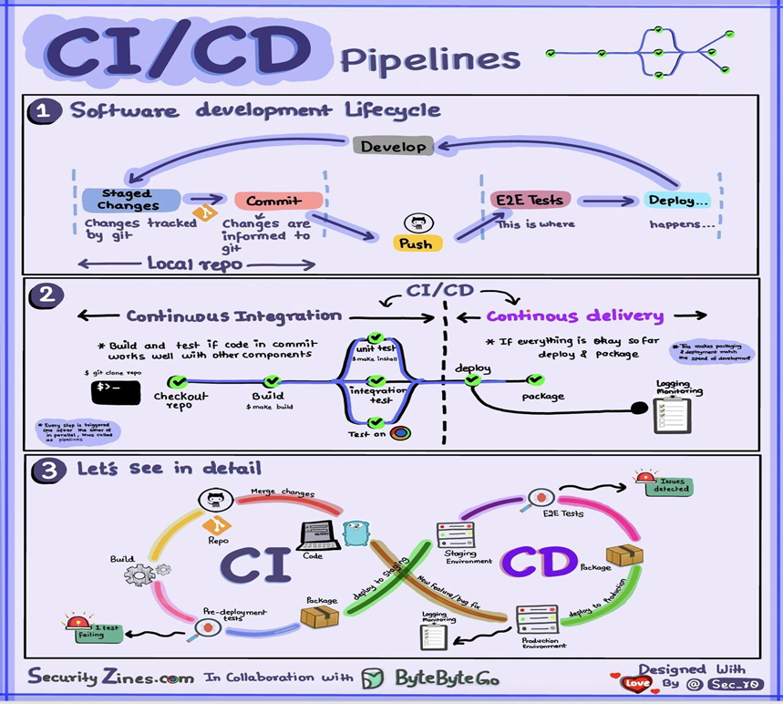
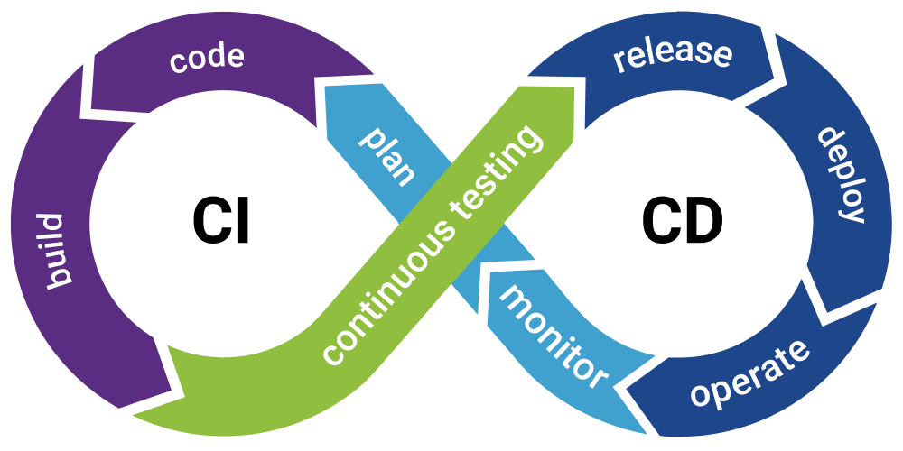

# What is CI/CD

## Long story short

If a program is a living creature, CI/CD is the age of it.

A program must follows the following cycle of development in order to get deployed.

From local repo : Staged changes are made and committed. Git serve as the historical archiver to save all changes made in the life time of the repo.

Git : After all changes are synced to the remote repo, collaborators can now see the changes and fetch it

Remote : With the changes received, the testing phase begin anew, with automated testing and manual testing to make sure features function as intended, servers can handle workloads, client requirements can be met without sacrificing new potential for developments.

In short, a very standard system. Where did it go all wrong in the actual deployment process?

## The actual massive problems

<h1 style="font-size:89px">Is this big enough of a problem?</h1>

### Parallel feature development

New feature -> new build ->  new compilation -> new code breaks -> developer cries -> **can't fix the issue** without the original coder

New features rely on old components using **outdated library with more security holes** than swiss cheese

### Basic standard 

**No standard, no convention, more wasting time** in the editor chief department.

No one is **testing the code before integrations** so bugs are everywhere.

**No branching** since it's "harder to manage multiple pieces of code at once"

## The solution

Instead of indepedent CI/CD, we needed a more standard system of integrating the new codes without breaking everything we built.

Introducing CI/CD pipelines. Notice how it is different from normal CI/CD.

It's never ending cycles of works, with a twist.

## The actual implementation

Git Pull Request. 

Instead of mashing all builds together, all developers share a common build tree, then branch from that tree and begin to make their own codes modifications for their functionality specifically.

Note that this **does not cover core library changes.**

This is only half the battle, and the core reason of all the suffering one have to go through.
