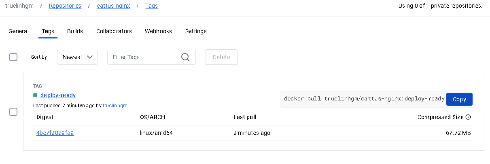

Docker Registry is a just a repo for all images that were uploaded by users, that when needed kurbenetes or docker can pull them from remote and deploy.

# For creating a new image in Docker Registry
## Step 1: Make a docker account first
## Step 2: Login the account
```
docker login -u <username>
```
## Step 3: Tag the image , the same tag that you see
```
docker tag cattus-nginx myusername/myapp:v1
```
For my case
```
docker tag cattus-nginx truclinhgm/cattus-nginx:deploy-ready
```
## Step 4: Push the image
```
docker push truclinhgm/cattus-nginx:deploy-ready
```
Run result should look like this
```
[root@server-devtest images]# docker push truclinhgm/cattus-nginx:deploy-ready
The push refers to repository [docker.io/truclinhgm/cattus-nginx]
38db93905073: Pushed
5661c46c6bea: Pushed
7bf3eb1a80e4: Mounted from library/nginx
43adef21ed65: Mounted from library/nginx
f7df5efb2c99: Mounted from library/nginx
5b316f9079a1: Mounted from library/nginx
5e19cd5b03d0: Mounted from library/nginx
678ea5c52c14: Mounted from library/nginx
8d853c8add5d: Mounted from library/nginx
deploy-ready: digest: sha256:4be7f20a9fa9853ccd9d826a441c5decfe1771a6fe3d4ad63f592160d37f6718 size: 2193
```

## Step 5: Confirming the image existence
The docker image should look somewhat like this


```
docker pull truclinhgm/cattus-nginx:deploy-ready
```

# For pulling an image from Docker Registry
## Step 1: Find an image suitable on the Docker Registry first

For example, this link: https://hub.docker.com/_/hello-world

## Step 2: From that website get the pull command
```
docker pull hello-world
```

## Step 3: Run it
## Step 4: Follow the process of creating containers as described in the Docker Guide folder

# Remove image from a specific repository
```
docker rmi cattus-nginx:latest
```