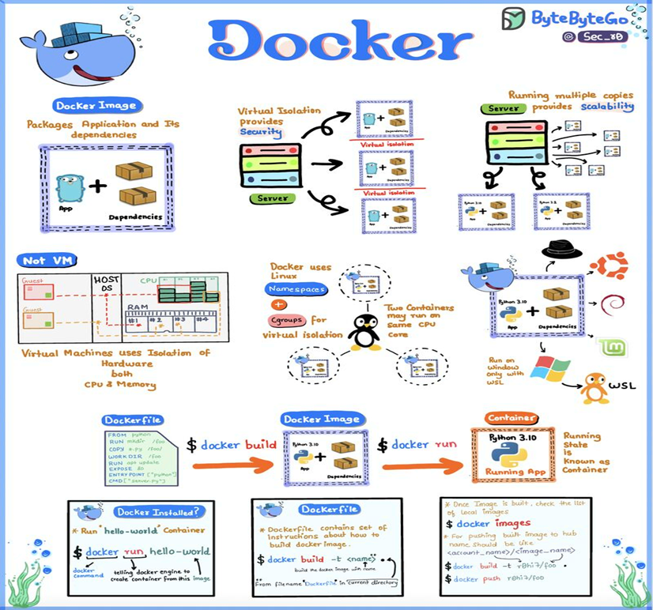

# Docker

Look how happy that whale is. The goal of docker is precisely that. Happiness. 

Long gone are the ages where we must deploy items pieces by pieces, install every single packet with a lock file. **Docker contains the complete and compiled build of the software / library / image with all the needed tools** to make it run safe and smoothly. 

## How does Docker work?

1. Bundle Everything
2. Virtual Isolation
3. Not VMs
4. Windows Compatibility

What more can be said about it?

The docker is essentially a full mobile platform so it is not a VM.