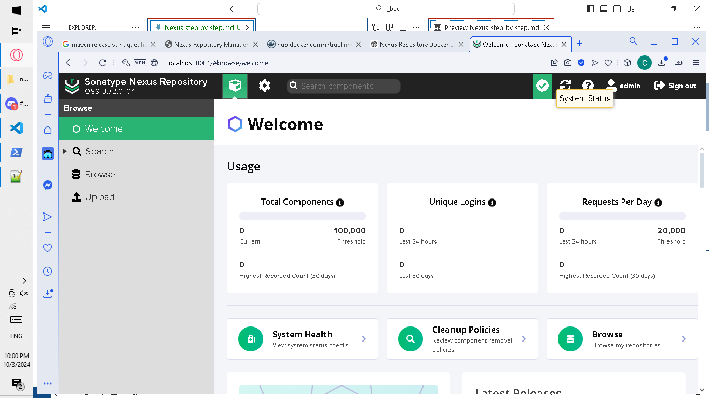

# For windows
## Step 1. Install Nexus Repository on Windows
- First of all, download Nexus Repository OSS.
- Unpack and go to bin folder
- Powershell to run
```
nexus.exe /run
```
- Nexus should now be running on http://localhost:8081.
### Access Nexus:

Open a browser and go to http://localhost:8081.
Log in with the default credentials (username: admin, password: located in nexus-data/admin.password).
### Make a new password admin
```
rVkTVJ5U2RdhJgu
```
## Step 2: Create a Docker Repository
### Navigate to Repositories:
Click here btw

In the Nexus UI, go to the "Repositories" menu.
### Create a New Docker Repository:
- Click "Create repository" and choose docker (hosted) from the list.
- Name it 
  ```
  cattus-nexus
  ```
- Select your desired port or leave the default, and configure other settings like the Blob store.
- I chose 8082 on http
## Step 3: Enable the Docker V2 API.
### 3.1 Set Up Docker to Use Nexus
Edit Docker Daemon Settings:
To use Nexus as a Docker registry, especially if you're not using HTTPS, you need to configure Docker to allow insecure registries.
On Windows, edit the Docker daemon settings:
Go to Docker Desktop settings.
Click on Docker Engine.
### 3.2 Add your Nexus repository IP/hostname under "insecure-registries" like so:

```
{
  "insecure-registries": ["<your-nexus-ip>:<port>"]
}
```
In my case, use

```
hostname
``` 

to get the proper ip address
```
{
  "insecure-registries": ["DESKTOP-0OFL577:8082"]
}
```
Save the settings and restart Docker Desktop.
## Step 4: Push Docker Images to Nexus
### Tag the Image:

In your Command Prompt or PowerShell, tag your Docker image:
```
docker tag <your-image>:<tag> <your-nexus-ip>:<port>/docker-hosted/<your-image>:<tag>
```
In my case
```
docker tag truclinhgm/cattus-nginx:deploy-ready DESKTOP-0OFL577:8082/cattus-nexus/cattus-nginx:deploy-ready
```
Since my image is
```
docker pull truclinhgm/cattus-nginx:deploy-ready
```
### Login to Nexus via Docker:

- Run the Docker login command:
```
docker login <your-nexus-ip>:<port>
```
In my case
```
docker login DESKTOP-0OFL577:8082
```

## Step 5: Push the Image:

Push the tagged image to Nexus:
```
docker push <your-nexus-ip>:<port>/docker-hosted/<your-image>:<tag>
```
In my case
```
docker push DESKTOP-0OFL577:8082/cattus-nexus/cattus-nginx:deploy-ready
```
## Step 6: Pull Docker Images from Nexus
Log in (if required):
```
docker login <your-nexus-ip>:<port>
```

```
docker login DESKTOP-0OFL577:8082
```
Pull the Image:

```
docker pull <your-nexus-ip>:<port>/docker-hosted/<your-image>:<tag>
```
```
docker pull DESKTOP-0OFL577:8082/cattus-nexus/cattus-nginx:deploy-ready
```

# Changes for Red Hat Linux
## Step 1: Install Nexus 
Recommended to move to a known folder
and install the jdk
```
sudo yum install java-11-openjdk -y
```

```
wget https://download.sonatype.com/nexus/3/latest-unix.tar.gz
```

```
tar -xvzf latest-unix.tar.gz
```
## Step 2: Own the repo to make it work 
Version number is from the folder extracted

Move it to opt folder, the optional addon of the system.
```
sudo mv nexus-<version> /opt/nexus
```
In my case: nexus-3.72.0-04. But I don't move it to avoid losing sights of where the  this is.
```
sudo mv nexus-3.72.0-04 /opt/nexus
```

Create a new user to manage this if you want
```
sudo useradd nexus
sudo chown -R nexus:nexus /opt/nexus /opt/sonatype-work
```

Must own it regardless btw, the user must own the directories and is not root.
```
sudo chown -R kirigiri:kirigiri /home/downloads/nexus-3.72.0-04
sudo chown -R kirigiri:kirigiri /home/downloads/sonatype-work
```

## Step 3: Create nexus service file
```
sudo vi /etc/systemd/system/nexus.service
```
Paste the data in from nexus.service in this folder.

The user must own the directories and is not root.
## Step 4: Activate the
```
sudo systemctl enable nexus
sudo systemctl start nexus
sudo systemctl status nexus
```

## Step 5: Connect the gui
```
http://<your-server-ip>:8081
```
In my case
```
http://172.116.125.31:8081
```
## Step 6: Use the admin
see password
```
cat /home/downloads/sonatype-work/nexus3/admin.password
```

```
bdabe486-0fa3-4ad5-8fb4-197ed0528b48
```
For me, I changed it to
```
applepie
```
After that change password to something

## Step 7: Push Docker Images to Nexus
### Tag the Image:

In your Command Prompt or PowerShell, tag your Docker image:
```
docker tag <your-image>:<tag> <your-nexus-ip>:<port>/docker-hosted/<your-image>:<tag>
```
In my case
```
docker tag truclinhgm/cattus-nginx:deploy-ready 172.116.125.31:8082/cat-nexus/cattus-nginx:deploy-ready
```
Since my image is
```
docker pull truclinhgm/cattus-nginx:deploy-ready
```
## Step 8
### Login to Nexus via Docker:

- Run the Docker login command:
```
docker login <your-nexus-ip>:<port>
```
In my case, change it to 8083 since 8082 is in use, also reload the docker 
```
sudo systemctl restart docker

docker login 172.116.125.31:8083
```

## Step 9: Push the Image:

Push the tagged image to Nexus:
```
docker push <your-nexus-ip>:<port>/docker-hosted/<your-image>:<tag>
```
In my case
```
docker push 172.116.125.31:8082/cat-nexus/cattus-nginx:deploy-ready
```

## Pull the Image:

```
docker pull <your-nexus-ip>:<port>/docker-hosted/<your-image>:<tag>
```
```
docker pull 172.116.125.31:8082/cat-nexus/cattus-nginx:deploy-ready
```

# Optional: Using HTTPS
If you want to secure your Nexus Docker registry with HTTPS:

You’ll need to configure Nexus to use SSL or set up a reverse proxy with Nginx or Apache on Windows.

# Optional: Change port for nexus service
Location of the file to change
```
/sonatype-work/nexus3/etc/nexus.properties
```
Depends on where you moved it too.

Find these lines, uncomment to change them
```
# Jetty section
# application-port=8081
```