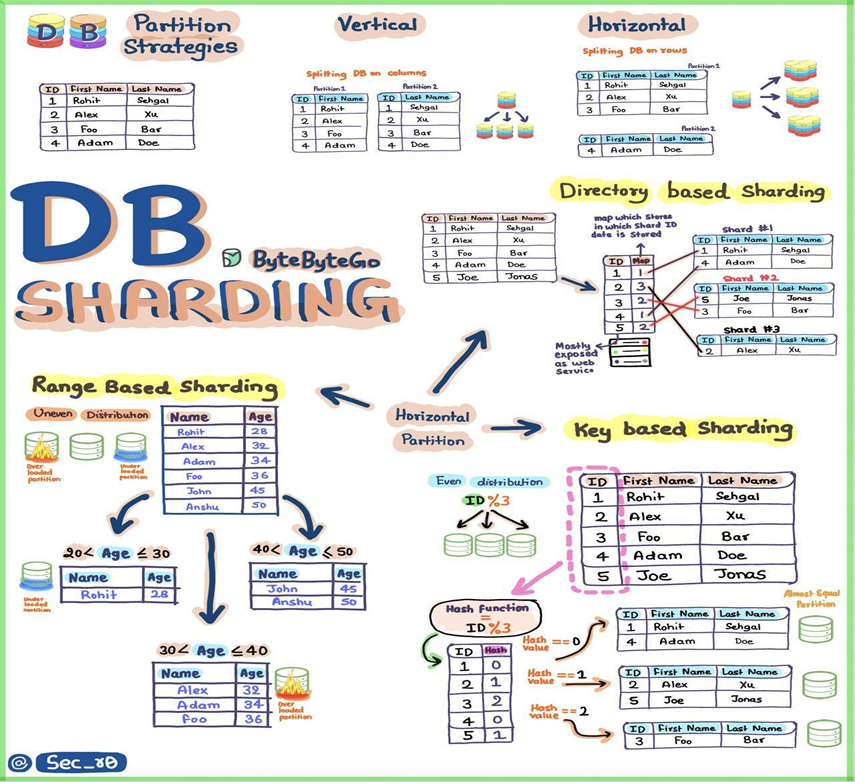
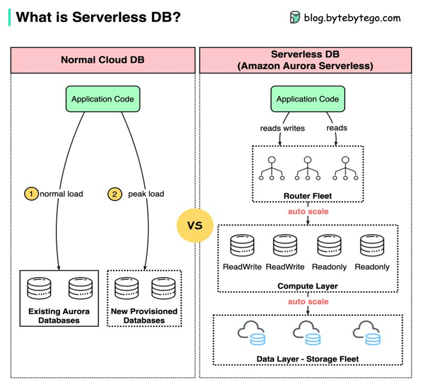

# Slide 3-13
## 3 Programming language
- Either compile or inteprete based on languages. 
- Compile create machine codes or give manual instructions to the operating system/virtual machine
- Bytecodes are set of instructions to run on VM, this also mean to decompile the bytecodes -> need a specific decompiler like dnspy to decompile.
- This also mean languages rely on vm should be less susceptible to memory leaks, since the virtual address wouldn't affect the actual hardware, at the cost of losing some speed optimization since it's a compatibility layered on top of another intepreter.

## 4 Caching strategies
- Not all information are accessed from disk or database, rather through a third party aka caches
- Stragies include:
    - C_Aside : Update both cache and db, which guarantee a **very bad desync rate**
    - R_Through : Cache manage the Database which guarantee **one point of entry, easier to penetrate**
    - W_Around : If caches dont have data, get from server then update the cache, basic structure.
    - W_Back : Cache is used as a source of truth, then update the DB after a period of time. While **safe and convenient** for using, chances are the caches might get **corrupted/abused and lose all transactions data**, which happens a lot, in a case such as toram online during the first year of operating which had to reset the whole database due to a fraud.
    - W_through : Similar to W_back but **directly operate** like R_Through, which **negates the effect of losing data** but **increased traffic** means increased cost


## 5: 5 Unique **ID** Generators
- Unique ID provides a layer of accessibility(read speed and write indexing) as well as security to information stored in the database.
- UUID: Random number based UUID might have conflict, but timestamp based UUID and namespace based UUID are safe for using. Due to the nature of hashing, such ID are **not sequential and inefficient for database indexing**.
- Snowflake: We create an internal indexing system which then guarantee the uniqueness of each ID within their domain, for example:
    ```9099091239``` might mean data warehouse `9`, any ID after it is guaranteed to be unique within data warehouse 9. This system is **fast and indexed, scalability** come with the risks of **getting penetrated** due to <b>known rules of indexings</b>.
- Database auto-increment: This ID system scream "WE DONT HAVE ENOUGH CUSTOMERS" to anyone who know the current indexes of the database, and **DOES NOT GUARANTEE UNIQUENESS ON THE WHOLE DATABASE**
- DB Segment: It's a part of snowflake system, or very similar, which each database server holds a certain number of ID, allows the system to get efficient I/O access.
- Redis : Got tired of waiting for database query? We keep **everything in the RAM** now apparently.
  
## 6 How Redis persist data
Data persistence is not performed on the critical path and doesn't block the write process in Redis.

● AOF: Write-after log, serve as CDC (Change Data Capture) for Redis

● RDB: If the server ever go down, all data will be gone. In case of such failures, RDB serve as a backup similar to how Github operate.

## 7 Google Sheets as backend
- Pros: 
    - Cheaper to implement
    - All data are **online and presist** since it's google
- Cons:
  - God saves us if the serverless computing doesn't create issue with **bots and unauthorized access**

## 8 CRUD ( Create Read Update Delete) vs Event Sourcing
- If CRUD is the base of all operations, Event Sourcing is the logbook that records everything CRUD does, which allows for **an alternative path of recovering database**

<div style="page-break-after: always;"></div>

## 9 Firewall
- As a rule of thumb, one must remember. **Firewall protect against outside attacks, not inside attacks.**

- Firewall can be both hardware or software
- Packet filtering basically prevent unsourced machines from sending packets to the machines by **blocking packets from ports or IP address**
- Circuit level gateway: Check for TCP handshakes for legitmacy, can be used to prevent DDos attacks before they have a chance of sending an attack
- Application level gateway ( aka proxy firewall) : Create your own rules of filtering packets or implementation of connections regulations.
- Stateful inspection : Track all packets to see if they are acceptable within their domain of data stream given their context.
- NGFW : Next Generation Firewall that serve as the baseline of how everything is monitored, like **intrusion prevention, deep packets analysis, application awareness.** Such an example would be <span style="color:blue">IBM QRadar SOAR</span>. Built in intrusion prevention, with AI monitored systems to guarantee an application is doing exactly what the policy entails.

<div style="page-break-after: always;"></div>

## 10 Linux Performance Observability Tool


Since there are too many, we focus on most important tools.

‘**vmstat**’ - reports information about processes, memory, paging, block IO, traps, and CPU activity.

- ‘**iostat**’ - reports CPU and input/output statistics of the system.
- ‘**netstat**’ - displays statistical data related to IP, TCP, UDP, and ICMP protocols.
- ‘**lsof**’ - lists open files of the current system.
- ‘**pidstat**’ - monitors the utilization of system resources by all or specified processes, including CPU, memory, device IO, task switching, threads, etc.

## 11 Message queue
- Since the system must deal with desynchronization , such as messages brokers, the queue system is used to guarantee the safety of data as well as the order of which data are procssed
- Queues have three design principles
    - at-most-once: <span style="color:red">will lose data but have exceptional speed</span>
    - at-least-once: guaranteed to have duplicates of data, doomed if you use, doomed if you don't.
    - exactly-once: require another system of managing the queue, but the cost can be alleviated using hashes to guarantee at-least-once is used to confirm the transactions then overwrite the data with same hashes to store them

## 12 Where do we cache data
Not all data are needed to get cached, only data that are required to transfer.
Thus the tools that keep data cache should be either get access frequently or convieniently placed near users.

These include, but not limited to:
- Client apps (Duh) 
- CDN (Content Delivery Network)
- Load Balancer (Can be used if the system load is too heavy)
- Services (Cache strategies)
- Distributed Cache (**Use key-value pairs**, which make the database run smoother because operations can be sharded between machines)
- Database (Of course, a database of caches for databases)
Transaction log (Operating log, unconventional method)
Replication Log (Used frequently since it's a replica of the database at it's stable form)

## 13 Session, Cookie, JWT, OAuth2 and the birth of SSO

Long ago, when websites don't persist too many functions, a simple login form (today also known as WWW-A) was sufficient. 

Then everyone realized that every operation would need a login since **<span style="color:red">the authorization doesn't persist</span>**. Session and Cookie were created in response as a way for the server to retrieve the user data without relogging

But cookie **<span style="color:red">wasn't designed for mobile apps</span>**. So tokens were created as an universal way for all application to apply. JWT is created, **contains signing keys which can be trusted**.

Now we have too many applications, thus **<span style="color:red">signing in become a hassle</span>**. SSO solve this issue by sharing the user profile from a central authorization server.

OAuth serve as the policy which **All OPERATIONS MUST OBLIGE TO.**

<div style="page-break-after: always;"></div>

# Slide 14-24

## 14 Types of software engineers


Front end is user sided, including **User Interfaces and User Experience**.

Back end is where **businesses logics are implemented and handled**.

Where the two sides meet are "Full Stack", the one where operations are performed at the most atomic form and delays are rarer, however, should the developers elope with another company, it spells **the end of the product without a manual**.

<div style="page-break-after: always;"></div>

## 15 Webhook vs Polling
- Since operations don't always complete instantly, we needed a method for **desynchronization and data consistency.**

- Webhook serve as open port of the server, when the operations are run, **the client respond at this webhook address to notify the server of the completion, failure, delay, requirement.**
- Polling serve as a hotline between server and client and is the **fallback for the interact protocols** when Webhook is unavailable.

## 16 Inter-process communications
There are 5 types total, and we should only need these 5 unless something really bizarre happens.

- Pipe : Literally connecting one end of a process of another process. Similar to how apis work, it share the same weaknesses apis have 
- Message queue : Everything is recorded into a single queue
- Signal : Works similar to how machines ask for remote host ports, if a process is holding the connection, other processes will wait. <span style="color:red">May lead to race conditions</span>.
- Semaphore : Processes waits until the value is set to a certain value, in this way there is **no race condition or desyncrhonization**, but will look very weird.
- Virtual memory : Programs handle the communication by themselves, which is the most frequently used by large companies, but also the worst solution possible, prone to errors and should the virtual machine is hacked, there is no stopping it since the evil process already detached from the server.

## 17 Upload large files
- **Just cut the file, file cutter**, said the Multi-part upload.
- We reassemble the files back to their original state at the peers. This guarantee an integrity check is confirmed upon inspection.

## 18 Redis vs Memcached

Redis is just superior to memcached, except for the architecture, because memcached relies on multiple processes which allows it for having multiple load balancers.

<div style="page-break-after: always;"></div>

## 19 Eight data structure
They are known as the big 8 of data.

- Skiplist : Instead of an array, **each item know where the next and the previous item is**.
- Hash index : Used in map structure since anything with an unique index use map.
- SS Table : A data tree that **allows fast read and write access but need to re sort** every time new data are inserted into the database. Immutable.
- LSM Tree : Log structured merge tree, an abomination created by joining Skiplist and SS Table with are both known for their **high write throughput** since the pointer only contain a single unit of data.
- B Tree : Self balancing tree, the **most consistant performance** since it works well on disks.
- Inverted index : Instead of storing the data, we store a list of known data then store the new data in form of a tree made of known indexes from the list, **replacing the data with indexes**.
- Suffix tree : Hoffman tree. 
- R Tree : The more data overlaps, the better this database perform.

## 20 Where are data structures used
- list: Singular **array of information** that users can rely on
- stack: The evolution of any data are kept safe here
- queue: User actions in-game, since users know what they did and expect the game to **respect that order**
- heap: Task scheduling, anything with a tree structure is functional for a task schedule, or anything with order
- tree: Keep the HTML document structure, or for AI decision. Not viable as a tool of high performance data storage but **extremely efficient as the roadmap generators**. 
- suffix tree: Searching string in a document, a specific case of trees
- graph: **Tracking and visualize the data**
- r-tree: Finding the nearest neighbor, useful for clustering 
- vertex buffer: Sending data to GPU for rendering, very specific.

## 21 Design patterns

♦ Builder: Lego Master - Builds objects step by step, keeping creation and appearance separate. Similar to Factory but only produce evolutions of a class, completed in the last part. 

♦ Prototype: Clone Maker - Creates copies of fully prepared examples.

♦ Singleton: One and Only - A special class with just one instance. Useful for managing a single service.

♦ Adapter: Universal Plug - Connects things with different interfaces. Useful when the new interface is required for an old system, or when data types don't match.

♦ Bridge: Function Connector - Links how an object works to what it does. Connecting abstraction to implementer, this way interfaces can be reused for different similar classes and each class still hold their own implementations.

♦ Composite: Tree Builder - Forms tree-like structures of simple and complex parts. One components can contain sub components.

♦ Decorator: Customizer - Adds features to objects without changing their core. Like customizing a pizza, you can add cheese but the bread is always guaranteed. 

♦ Facade: One-Stop-Shop - Represents a whole system with a single, simplified interface. Batched commands are considered a part of facade system.

♦ Flyweight: Space Saver - Shares small, reusable items efficiently. Used in vm ware where processes share same hardwares, or users sharing the compiler in the same vm.

♦ Proxy: Stand-In Actor - Represents another object, controlling access or actions. Serve as an empty blanket that only call real data when needed.

♦ Chain of Responsibility: Request Relay - Passes a request through a chain of objects until handled. For example, an auto parsers will try every single compiler, each step is a part of the chain.

♦ Command: Task Wrapper - Turns a request into an object, ready for action. Basically an interface for interactions.

♦ Iterator: Collection Explorer - Accesses elements in a collection one by one. The most important part of any operation is accessing the data, and iterator provides the solution for all to use.

♦ Mediator: Communication Hub - Simplifies interactions between different classes. Like a coffee making machine, the users select options and the machine know which components to call, and in which order thanks to the meditator.

♦ Memento: Time Capsule - Captures and restores an object's state. A back up system for the class instances.

♦ Observer: News Broadcaster - Notifies classes about changes in other objects. Always listening to all changes to report to other components.

♦ Visitor: Skillful Guest - Adds new operations to a class without altering it. Visitor essentially add operations to classes without changing the classes, making it essential for hot fixes.

<div style="page-break-after: always;"></div>

## 22 Code Review Pyramid

- If anything go wrong, ask the reviews.

<div style="page-break-after: always;"></div>

## 23 HTTP Responses
- Informational (100-199)
- Success (200-299)
- Redirection (300-399)
- Client Error (400-499)
- Server Error (500-599)
  

## 24 Writing codes that run on all platforms 
There are many options

- Cross platform intepreter : Constraint and extra works
- Using universal platform : Constraint on overhead since optimization is not possible
- Isolate platform support into code modules : Like adding more metal on a metal bar, it just get heavier and resistant to change
- Emulator : Compatibility is a guaranteed issue since the instruction sets may not be emulated efficiently.
- Adaptable code plans : Since universal codes are unreal, we create codes for the same functionalities accross languages and platforms.
- Engage in code sharing platform : How is this a solution ? It reduces the amount of works, but make the codes become complex since the codes are not designed to works with system requirements.

# Slide 25-35

## 25 Latency number we should know


## 26 Proxy vs Reverse Proxy
Proxy protect users, reverse proxy protect the servers.

## 27 Symmetric vs Asymmetric Encryption
Both peers use the same system of keys which can always be used to access or encrypt the data, and since the data are encrypted in batches, **symmetric's fast.**

However, if bad actor grab a key, it's game over for security. When traffics happens, things are bound to be **lost in traffic**. And there can **only be so many keys** since the algorithms have a length standard.

Asymmetric keys don't need to transfer the secret key, which allows for **secured transfers between peers** as long as the secret key isn't lost.

The backside is that the algorithm is too complicated to run efficiently, which make encoding and decoding ultra **slower compared to the symmetric algorithms.**

## 28 Load balancing algorithm
Since a system can't always rely on a single unit to process all data.

### Static:
- Round Robin : A queue system which run based on whichever request came first, then whichever request surpass a certain degree of heavy duty will be partitioned into smaller parts. This also mean this balance only maintains **if the processing rate is assumed to be uniform across all instances of services, thus should only be available for stateless services.**
- Sticky R2 : Basically same as Round Robin but we assume each pair of query is from the same host, prone to errors.
- Weighted R2 : Now we specify a host is stronger than other host and allowed to handle more requests than others.
- Hash : Random BS goes here, why bother with balance when you can just send requests based on a rule that completely remove all optimizations.
### Dynamic:
- Least connections : Whichever peer has the least concurrent connections will be chosen for the next requests.
- Fastest response time : This is **the best solution but the most prone to error** due to the fact that a request might be too light to confirm how fast the system can respond.

## 29 What's the deal with Program and Process and even Thread ( get it ?)

- Programs are **sets of instructions.**
- Processes are the **loaded instances of a program in RAM**, hence there can be multiple processes of a same program.
- Threads are the **representations of the calculations being made by the program**, hence they have address of the virtual thread aka process.

With that established, no threads can run by themselves to produce meaningful actions, they need to notify other threads of their actions, which is why **inter-thread communication is required and must run fast since threads are inherently, I/O blocking operations.**

## 30 Cookie vs Session

Cookie was created as a solution for authorization, but that also means it **can get stolen.**

The solution was managing **a new entity that can effectively encapsulate the cookie, and server can control it directly** without interfering with legimate operations.

<div style="page-break-after: always;"></div>

## 31 What make URL an URL?

URL are , universal resource locator. URL innit?

But in all honesty, URL are important.

Query using URL are unsafe, but we can tolerate it for public API.

Parameters tell the host what the requests need. Fragments of all things are frequently used when dynamic loading wasn't a thing in older internet protocols. 

I'm not satisfied with this conclusion but URL are very ancient so we can't say more.

## 32 Internet Traffic Routing Policy

Just like a city, the internet has roads of traffic. Routing are just traffic laws that packets must follow in order to get to an end point. A server can have many mirrors to support a single service, each of these services are considered to be a single end point of the server.

There are total of 6 universal ways of doing it, but just like traffic laws, it only get to the point where congestions are impossible to avoid.

- Simple : Can't reach then just fail. Very common and the most frequently used by new devs since they don't have the fund to deal with back ups or fall back.
- Fall back : Fall back. It's just back up of the service. What more can you possibly squeeze from this other than the fact it's redundancy and expensive.
- Geolocation : Our houses have been next to each other since birth.
- Latency : Wrap me in plastic and let me shine. You basically never gonna meet me live.
- Multivalue answer : I have a coin, meet me on the flip side.
- Weighted routing policy : Democracy is eternal.

<div style="page-break-after: always;"></div>

## 33 JWT
All technical details are important 


JWT is a token used for authentication.

<div style="page-break-after: always;"></div>

## 34 Linux Operating System Commands


There is not a better description than this chart, if one need to use a more complicated command, command /help would guide the user.

<div style="page-break-after: always;"></div>

## 35 Linux Boot Process


Power go into the circuit -> BIOS Awaken -> Request and detect devices -> Choose a boot device like disks -> Boot load using grub, execute kernel commands and load supported libraries -> execute systemd thus manage all processes and check all hardwares -> run target files which are default files -> execute startup scripts which are just shell commands and scripts that users customize.

<h1> This is the point </h1>
Well that's one-fifth of this 

<div style="page-break-after: always;"></div>

# Slide 36-46

## 36 Payment system


FedNow is automatic and FedWire which use ACH ( Automatic Clearing House aka only clearing the cached transactions ).

The difference is that ACH needs human operators since there are confirmation made by humans.

<div style="page-break-after: always;"></div>

## 37 OSI Models

Please Do Not Touch Sausage PizzA


<div style="page-break-after: always;"></div>

## 38 Fullstack operations


Everything a fullstack dev need is basically whatever you can imagine needed for a server operation.

<div style="page-break-after: always;"></div>

## 39 Web protocols


I don't think there is a remark to be made here, except i'm burned out.

## 40 ACID 

Our favorite rules, among ACIT

- Atomicity : Everything is chained together in batch, either the whole batch get accepted into the system or get rejected.
- Consistency : Github
- Isolation : Each query acts like the only running operation. We just throw the lost one out.
- Durability : Data is backed up

<div style="page-break-after: always;"></div>

## 41 OAuth 2.0


The land of promises, essentially just slap SSO on all services. Big companies hate this because they can't access user information.

<div style="page-break-after: always;"></div>

## 42: 9 http request types


I remember all of them by heart.
We can summarize them with simple syntaxes.

<span style="font-size:29px">Get get, put change, post make, delete gone, patch partial, head rolling, connect tunnel, options list, trace loop.
</span>
That's all folks.

<div style="page-break-after: always;"></div>

## 43 SSO


User make a single profile and share the same profile across all services and memes.

## 44 IaaS / PaaS / SaaS

Infrastructure is the hardware, Platform is the software foundation, Software is the implementation completed.

<div style="page-break-after: always;"></div>

## 45 Data Storage structure


Block storage is just physical disk storage. File Storage are just a way of abstraction to manage the block storage.

Object storage are essentially raw bits data, thus cold. Therefore they don't need write access but frequently need to be retrieved from the service.

<div style="page-break-after: always;"></div>

## 46 Performance chart
For database


<div style="page-break-after: always;"></div>

# Slide 48-1-58

## 47 URL and URI and URN


Locator knows, Identify only,

<div style="page-break-after: always;"></div>

## 48 OAuth2 flows


In Authorization Code flows, the user contact the IdP directly, but the server holds the actual access token and therefore is actually controlling the session.

All other flows, the user control the actual access token and the server only serve as a store clerk.

Think about buying stuffs in a shop.

User have a credit card. If we set AC route, user contact the clerk and have the clerk serve as a representative to the bank. 

If not, user are using checks, also known as debit cards. These checks are made before hand between users and their banking services which get validated or transacted from banks.

<div style="page-break-after: always;"></div>

## 49 HTTPs 
And the cluster of issues with it.


Https can be rectified and summarized with a single word. <span style="font-size:49px">**Asymmetric**</span>. 

All websites have their own cert, known as website certificates. In order to verify a website contents, there is a standard string that is verified by using said websites public key.

<div style="page-break-after: always;"></div>

## 50-51 CI/CD


If a program is a living creature, CI/CD is the age of it.

A program must follows the following cycle of development in order to get deployed.

From local repo : Staged changes are made and committed. Git serve as the historical archiver to save all changes made in the life time of the repo.

Git : After all changes are synced to the remote repo, collaborators can now see the changes and fetch it

Remote : With the changes received, the testing phase begin anew, with automated testing and manual testing to make sure features function as intended, servers can handle workloads, client requirements can be met without sacrificing new potential for developments.

In short, a very standard system. Where did it go all wrong in the actual deployment process?

## The actual massive problems with single CI/CD

<h1 style="font-size:89px">Is this big enough of a problem?</h1>

### Parallel feature development

New feature -> new build ->  new compilation -> new code breaks -> developer cries -> **can't fix the issue** without the original coder

New features rely on old components using **outdated library with more security holes** than swiss cheese

### Basic standard 

**No standard, no convention, more wasting time** in the editor chief department.

No one is **testing the code before integrations** so bugs are everywhere.

**No branching** since it's "harder to manage multiple pieces of code at once"


## The solution

Instead of indepedent CI/CD, we needed a more standard system of integrating the new codes without breaking everything we built.

Introducing CI/CD pipelines. Notice how it is different from normal CI/CD.


It's never ending cycles of works, with a twist.

## The actual implementation

Git Pull Request. 

Instead of mashing all builds together, all developers share a **common build tree**, then **branch** from that tree and begin to make their own codes modifications for their functionality specifically.

Note that this **does not cover core library changes.**

This is only half the battle, and the core reason of all the suffering one have to go through.

## 52 Kafka

Kafka is fast, unlike it's difficulty to remember it's name.

The reason is simple: Ordered I/O. Also known by it's better name. **Sequential I/O**.

The cache can **consume time, even with this writing speed**.

Remove cache speed problem by **no cache, aka zero-copying** techniques.

Since the program is using a connection, usually data changes are stated in the socket buffer for speed upload then written to NIC (Network Interface Card) for transfering. 

Kafka removes the need for writing in socket buffer since the server operate on **single-flow principle: in and out** are in **different ports gates**.

<div style="page-break-after: always;"></div>

## 53 Git


Or it's more monstrous official title given by companies.

Distributed version control system.

Everything is only edited on their own branches. Everything is update with CDC and hashed version number. Thanks to this partial editing, and the final changes are only finalized in the push, git allows **desynchronized devsecops**.

<div style="page-break-after: always;"></div>

## 54 Cloud Native Anti Patterns

Whose idea was it to just move everything to the internet?

Let's dive in the most vile piece of skill issue the world ever see in IT.


- Monolithic Architecture: We can't see any other way of operating this sustem. -> We won't support it.
- Ignoring Cost Optimization: Since everything now runs on the cloud, you will have to put up with whatever problems come with using a remote host.
- Mutable Infrastructure: You don't ever corporate components together. If you do, you will be doomed to update.
- Inefficient DB Access Patterns: Overly complicated DB queries(looking at security) and lacks of indexing(FFA styles) leads to bottlenecks. What? You are telling me that database was failing due to bad database designs?
- Large containers / Bloated image: If you keep putting parts of a program into a singleton unit, you will suffer.
- Ignoring CI/CD Pipelines: Manually dying inside.
- Shared Resources Dependency: Since most of the processes are now sharing a same system of access on cloud, everything will go wrong at a slightest sight of a conflict between processes.
- Using too many cloud services without a strategy: Too many airports without airplanes or customers.
- Stateful Components: Lifting components up to manage them leading to overheads for states management.

## 55 Monorepo vs Microrepo


Companies have different strategies of developing softwares. 

<div style="page-break-after: always;"></div>

## 56 Microservice stack - Technology stack 


<table style="width:100%; border: 1px solid black; border-collapse: collapse;">
  <tr>
    <th style="width:50%; border: 1px solid black;">Pre-production</th>
    <th style="width:50%; border: 1px solid black;">Production</th>
  </tr>
  <tr>
    <td style="border: 1px solid black;">Define API</td>
    <td style="border: 1px solid black;">NGinx</td>
  </tr>
  <tr>
    <td style="border: 1px solid black;">Development</td>
    <td style="border: 1px solid black;">API Gateway</td>
  </tr>
  <tr>
    <td style="border: 1px solid black;">Continuous</td>
    <td style="border: 1px solid black;">The microservices are deployed on clouds</td>
  </tr>
  <tr>
    <td style="border: 1px solid black;"></td>
    <td style="border: 1px solid black;">Cache and Full-text Search</td>
  </tr>
  <tr>
    <td style="border: 1px solid black;"></td>
    <td style="border: 1px solid black;">Communications</td>
  </tr>
  <tr>
    <td style="border: 1px solid black;"></td>
    <td style="border: 1px solid black;">Persistence</td>
  </tr>
  <tr>
    <td style="border: 1px solid black;"></td>
    <td style="border: 1px solid black;">Management & Monitoring</td>
  </tr>
</table>


<div style="page-break-after: always;"></div>

## 57 Kurbenetes Tools Ecosystem


There are many tools but we just need to know 6 categories:
- Cluster Management
- Networking
- Container Runtime
- Infra Automation
- Security
- Monitoring and Observability
  
<div style="page-break-after: always;"></div>

## 58 What is k8s


### Control Plane Components
1. API Server: Front end for administrators and users to interact with the cluster.
2. Scheduler: Assign Pods to Node. Pods are softwares, Node are Platforms.
3. Controller Manager: Use API server to make sure the system is running pods in healthy state.
4. etcd (Distributed Key-Value Store) keeping all information of the cluster.
### Nodes
1. Pods: A set or subset of containers that share resources within the pod: storage, network, lifecycle
2. Kubelet: Manage and make sure containers inside a pod run, independent on each pod.
3. Kube Proxy: Protection between inside and outside, among the pods.

<div style="page-break-after: always;"></div>

# Slide 59-69
## 59 Cloud History


It's just history and doesn't support the actual image of the current landscape of the technology.

<div style="page-break-after: always;"></div>

## 60 Convert Cloud Native


### 1. Application definition development
- Database: If a software doesn't rely on database, it should be serverless. Otherwise, it's a desynchronization disaster waiting to happen.
- Containerization/ Image build: Turn softwares into a proper pod.
- CI/CD: Put it through the pipeline.
### 2. Orchestration and management 
- Orchestration: Automation of everything in a single piece of endpoint.

- Service Proxy, Discovery Mesh: Intermediator for requests. Instead of letting programs manually configure each dependency, all dependencies are managed by an abstraction layer, known as discovery mesh, allowing easier requests handling.

### 3. Runtime
- Cloud storage: Since everything works on cloud, of course you would need an actual database system that on cloud also always run to ensure connectivity and definitions update.
- Container runtime: Anything that make sure the container is operational, as presented in docker slide - 61

### 4. Provisioning
It's about managing and setting up the necessary infrastructure and resources required to run the application.
- Automation and configuration: Literally it but for containers. In this case we are talking about Kurbenetes as a tool.
- Container registry: Basically a dictionary for containers.
- Security and Compliance: If the manager can't control the unit then there is no point in deploying it in the first place.
- Key management
### 5. Observability: Understanding the systems and services in operations, allows generation of system data: including operation flows, system image for deployment, health status.
### 6 Serverless
- If something run without a need for interaction but open for inspection, it's called a serverless component.
- These includes hardware(duh), tools(how wild is this), framework(what), and platform.

<div style="page-break-after: always;"></div>

## 61 Docker


Summarized with a sentence: Everything all in one at the same location with minimal external dependency and no hardware restrictions.

Explained in details on how to install and use in C_06_Docker+K8S, due to the length of this file.

<div style="page-break-after: always;"></div>

## 62 Cloud Network Components Cheatsheet

May or may not be oudated. Need more investigations.


<div style="page-break-after: always;"></div>

## 63 Git merge vs git rebase vs squash commit


Git merge add modifications to the main branches without destroying changes made in either branch.

Git rebase add modifications behind the lastest commit, turning it into a linear update tree.

<div style="page-break-after: always;"></div>

## 64 Docker vs Kurbenetes


Explained in details in K8S.

<div style="page-break-after: always;"></div>

## 65 How does Docker work


Everything is explained in details in the Docker folder.

We can summarize in here with 

- Docker client is what we use to control the docker daemon
- Docker host is a broad name for the process of creating and make containers run from set of images.
- Docker registry is github style for dockers.

<div style="page-break-after: always;"></div>

## 66 Git vs Github
One is the tool and one is the platform that support the tool.


<div style="page-break-after: always;"></div>

## 67 Top 4 Kurbenetes Service Types


They meant structures, which is supported by industry standards.

● ClusterIP:
ClusterIP is the **default and most common** service type. Kubernetes will assign a  cluster-internal IP address to ClusterIP service. This makes the service only reachable within the cluster.

● NodePort: 
This exposes the service outside of the cluster by adding a cluster-wide port on top of ClusterIP. We can request the service by NodeIP:NodePort.

● LoadBalancer:
This exposes the Service externally **using a cloud provider’s load balancer**.

● ExternalName:
This **maps a Service to a domain name**. This is commonly used to create a service within Kubernetes to represent an external database.

<div style="page-break-after: always;"></div>

## 68 Devops vs noops
Words that don't mean anything. Devops just mean everyone is working on a branch. Noops means whoever do branches don't know about other branches. It's useful to add new features using noops but any meaningful features need devops.


<div style="page-break-after: always;"></div>

## 69 Logging, Tracings, and Metrics.

Logging is writing system statuses in logs.

Tracing find the sources of details.

Metrics are the statuses.


<div style="page-break-after: always;"></div>

# Slide 70-81
## 70 (Duplicated slide)
## 71 Test system functionality

- Unit testing: Ensures individual code components work correctly in isolation. Make sure each function is working as intended.
- Integration testing: Verifies that different system parts function seamlessly together. Meaning when the individual classes work properly together in the pipeline.
- System testing: System compliance testing.
- Load testing: System stress test.
- Error testing: Breaking system policy.
- Test automation: CI/CD pipeline go here.


<div style="page-break-after: always;"></div>

## 72 Monitoring cheatsheet


<div style="page-break-after: always;"></div>

## 73 Top 5 Kafka use cases


Kafka is fast disk writing/reading system, so it can handle many tasks. These include memory intensive tasks that need speed and volumes of works dealt with properly.

- Log Analysis: Logs are generated in real time, so it needs everything Kafka can provide.
- Data streaming in Recommendations: Since the feeds need get updates constantly, providing the system with a high speed read write is crucial without too many bottlenecks.
- System Monitoring and Alerting: Real time speed.
- Change Data Capture: The literal reason why Kafka was created.
- System migration: A side effect of having a fast read write system that is independent of the hardwares is that the system can be moved.

<div style="page-break-after: always;"></div>

## 74 Git episode 2


If someone don't understand how this graph works, I'm here to guide.

- Working Directory: The local disk where the coders write directly.
- Staging area: The files that hold the actual changes made in the folder, written in partial.
- Local repo: The local disk where the coders write directly. This includes the changes.
- Remote repo: The saved files on the internet.

The arrows tell how the files are transferred. 

## 75 (Duplicate of slide 71)

<div style="page-break-after: always;"></div>

## 76 How companies ship codes to production


My job is not copying from the slide into here, so I will simply put the image here. I do have few words about it.

This process is a lost cause. It shouldn't even occur to anyone to operating like this is a good idea. 

The reason is simple. Do you see the paths where you are supposed to cut short for a hotfix?

<div style="page-break-after: always;"></div>

## 77 Devops vs SRE vs Platform engineering


Devops are developers. SRE are engineers. Platform are literal physical engineers.

<div style="page-break-after: always;"></div>

## 78 Uber Tech Stack - CI/CD


Mostly for giggles, but the process is
- Plan
- Code
- Build
- Test
- Release
- Deploy
- Operate
- Monitor

<div style="page-break-after: always;"></div>

## 79 How to ship codes


<div style="page-break-after: always;"></div>

## 80 How to release a mobile app


It's very detailed. 

<div style="page-break-after: always;"></div>

## 81 CI/CD Simplified Visual Guide


We can summarize it even faster, assuming you read about CI/CD. 

Basically as long as there is no breaking changes to the foundation branch, we can use this. In most cases, breaking changes should guarantee a hot linked library, allows the app to morph different part of the funtionality without needing to rewrite the whole branch, unless it's security or improvements on speed.

In such cases, one might argue that the code changes should reflect the policy breaking changes, which always guarantee an evaluation of system.
<div style="page-break-after: always;"></div>

# Slide 82-93
## 82 Service Deployment Strategy
If coding is 1/3rd of the battle, then deployment is the second half. Aside from technical difficulties, keeping the system healthy and operational for many users at once consume a lot of resources, which means where there is a need for stability, there is a strategy.


We are taking a jab at every strategy and compare the pain.

- Multi Service Deployment: Everything is updated instantly and constantly. If anything breaks, god saves us.

- Blue-Green Deployment: Ease of uses, since you essentially have backup. But the cost of maintaining and operating is as big as double.

- Canary Deployment: We slowly move users away from the old versions by migration of certain bases of users. Monitoring and no staging is terrible, since now users will literally mix the responses between the old and new updates, making customer supports hell.

- A/B Test: With readily available bases, users would definitely suffer from this, but developers are scot off free since now everything either work or break.

In short, all of these are horrible practices that we should not ever accomplice for a big project.

The best solution for deployment would be just focusing on characterizing which part make the system work, and why it works. 

I propose a fifth solution for deployment, a bit of experience taught me this strategy.

Ask the users what they don't want to use most. And focus on getting it removed or upgraded, don't bother with any sort of upgrades if you can't rollback safely.

<div style="page-break-after: always;"></div>

## 83: 9 best microservices development practices


1. Use separate data storage for each microservice: Who could have seen that coming? I'm shaking and crying.
2. Keep code at a similar level of maturity: Define maturity level. What is even maturity.
3. Seperate build for each microservice: Keep a separate pipeline for each microservice. Why is this even a best practice, it's standard for all services.
4. Single responsibility: If a tool is made for a job, don't try to turn it into more tools, make a different tool to solve it but use an interface to hide the implementation. 
5. Deploy into containers: Doesn't need to be a microservice to follow this practice properly.
6. Treat servers as stateless: No microservices should have knowledge of any other instance of others running. This may sounds like a no brainer, but no microservices should have their states saved, the next user doesn't have to know about the plastic spoon another user holds.
7. Adopt domain driven design: Just say something smart here.
8. Micro frontend: Minimize as much as possible on the frontend, it's like an tool, not a clerk.
9. Orchestrating microservice: Use containers. Seriously. Always.

<div style="page-break-after: always;"></div>

## 84 Branching strategies

Anything has a strategy, even my library of books have strategies for strategies. 


What have we here?

- Normally, we would have a repository of things combined, apparently, for deployment purpose only. This also means this branch is the final merged branch of all functionalities and should not be committed or pushed directly, but only be merged.
- Hotfixes branches are the first one to get merged, but in reality, we all know where hotfixes happen. In develop branches. So hotfixes branches are more like emergency code packs for compatibility.
- Release branches are made mostly for backups, allowing users to avoid having newest versions that don't work.
- Develop branches are functionalities that are confirmed and being maintained
- Feature branches are experimental that we don't know if it should even exist, and might be merged into develop in order to be added.

<div style="page-break-after: always;"></div>

## 85 Title page
I think we can say something here.

This document, as far as I can see, is either stupid or just not functional, I wanted to make a book serve as proper of a guide as possible.

<div style="page-break-after: always;"></div>

## 86 Vertical vs Horizontal Partitioning


- Vertical: The most basic sharding form, which keeps the data in least column per table as possible
  - What are the catches? We all know there is a problem with a strategy. The problems are, sharding vertically only solves security issues, and complicates the process of extracting data.
- Horizontal: We separate a table into multiple data tables that serve the same purposes. This in turn allows the tables to actually function faster, but need a method of control for how should queries be processed.
  - As stated before, this only works if the database is so big, spending resources to implement this method is worth the risks.
  - The application also have to be table to solve the issue with uneven data, which means certain shards would contain more data than the others, depends on how big the partition size is.

<div style="page-break-after: always;"></div>

## 87 Understanding the database

Why do we have so many databases types?


1. Relational: When you need something with indexing.
2. Time-series: When you keep records using timestamps.
3. NoSQL: If structured models can't be used.

<div style="page-break-after: always;"></div>

## 88 REST API


REST API are all stateless. Which mean they only run once, don't know about other requests existences.

It has everything that post office has.

<div style="page-break-after: always;"></div>

## 89 Message Broker

If you work in banking and the stock market, a broker is extremely familiar. 

He works as your mediator for the stock market. 

Since the mediator are directly connected to the system, it can be guaranteed a high speed of working without having to wait for customers, broker don't stop working simply because there are no customers.


<div style="page-break-after: always;"></div>

## 90 Batch vs Stream Processing


- Batch processing is exactly what a broker would do.
- Stream processing is more for real time if anything.

<div style="page-break-after: always;"></div>

## 91 GraphQL ?


It's actually not brillant but we will take it. 

Instead of using multiple APIs, we are effectively using a single end point for all API actions, and resolving them using a processing method. 

It solves backward compatibility issues, most of it since now you only have to worry about a single gate. 

If the codes use this as a method for batching commands, it also get rid of majority of the sql exploits.

But you know what this never solves? Your incompetency. **Japan August 6th 1945.**

<div style="page-break-after: always;"></div>

## 92 What is a DB

Feel strange that this thing comes after we learned about databases types.


DB is Database. 

According to the slide.

First off, what's a database? Think of it as a digital playground where we organize and store loads of information in a structured manner. Now, let's shake things up and look at the main types of databases. 
- Relational DB: Imagine it's like organizing data in neat tables. Think of it as the well-behaved sibling, keeping everything in order. 
  - You would think it has high speed but apparently, relational is only good for showing the data of a 
- OLAP DB: Online Analytical Processing (OLAP) is a technology optimized for reporting and analysis purposes.
- NoSQL DBs: These rebels have their own cool club, saying "No" to traditional SQL ways. NoSQL databases come in four exciting flavors:
  - Graph DB: Think of social networks, where relationships between people matter most. It's like mapping who's friends with whom.
  - Key-value Store DB: It's like a treasure chest, with each item having its unique key.
  Finding what you need is a piece of cake.
  - Document DB: A document database is a kind of database that stores information in a
  format similar to JSON. It's different from traditional databases and is made for working
  with documents instead of tables.
  - Column DB: Imagine slicing and dicing your data like a chef prepping ingredients. It's
  efficient and speedy. My ass, this thing works like old gramp car.

<div style="page-break-after: always;"></div>

## 93 Cheatsheet of different databases


Just read it.

<div style="page-break-after: always;"></div>

# Slide 94-105

## 94 Visualizing a SQL query


About the execution order:

1. Select command run first. Obviously.
2. From filter the tables
3. Join fuse the data together
4. On connect data1
5. Where cut data
6. Group by tell what column gonna get displayed
7. Having is just more filter
8. Order by tell how to order based on the chosen column
9. Limit tell how many records should be used

<div style="page-break-after: always;"></div>

## 95 Top 6 use cases of Object Stores


1. Data Archiving: Basically a compressed format since the data is now no longer actively being used.
2. Unstructured Data: Data like images, videos, recordings, books, everything need to be saved and controlled.
3. Cloud Native Storage: Now we put everything in containers, including the actual data itself.
4. Data lake: Convert data when needed.
5. Internet of things: What.
6. Backup and recovery: What else can this not be used in/for? The possibilities are endless.

<div style="page-break-after: always;"></div>

## 96 PosgreSQL my babe


I used posgres too.

<div style="page-break-after: always;"></div>

## 97 Data Pipeline Overview

What is a pipeline anyways? A pipeline is a process standardized into a linear line for better controlling and tuning. 


It's pretty basic and works out exactly as one might consider. 

Collecting data, ingesting mean ordering, store data, compute mean do works with it, consume means actively processing data.

<div style="page-break-after: always;"></div>

## 98 Key concepts to understand Database sharding

Look at this I pasted from the slide.



- Range based sharding: It's horizontal sharding, meaning cutting the database into different tables containing data of different key ranges.
- Directory based sharding: It's range based but you manually control which range is holding the data. This allows for safer data controls but might not be a good idea for smaller system.
- Key based sharding: It's hash sharding in a nutshell, but with practical implementation.

<div style="page-break-after: always;"></div>

## 99 Data warehouse and Data lake

Seriously, what are these?


Data warehouse is unified in data types and structures, but data lake can hold anything. You can throw a truck in the lake and it's still a lake.

A data warehouse performs Extract-Transform-Load (ETL) on data. A data lake performs Extract-Load-Transform (ELT). 

A data warehouse is schema-on-write, which means the data is already prepared when written into the data warehouse. A data lake is schema-on-read, so the data is stored as it is. 

## 100 What Serverless DB



Is that even? This thing is a scam. It doesn't serve any purpose other than extra revenue.

<div style="page-break-after: always;"></div>

## 101 Choosing your suffering


All paths are painful, but one must take the path he shall seethe.

<div style="page-break-after: always;"></div>

## 102 Linux file system

An user would know that things are better in home folder for most softwares.

TL;DR

No one cares.


<div style="page-break-after: always;"></div>

## 103 Database Isolation level

Database Isolation is super important, it allows us to do concurrent transactions without breaking desynchronization.

- Serializable: What does that mean? It means we are enforcing concurrent transaction to wait for each other in a queue.
- Repeatable read: If a transaction is currently running, we want it to keep as close to the original data at the point of transaction as much as possible.
- Read committed: The changes must not take effect during reading before the commit of the transaction.
- Read uncommitted: Data can be read by other transactions before the transactions are completed.

One must understand that isolation level does not equal best practices, a problem can need very different isolation level, understanding which isolation level is needed is a skill.


<div style="page-break-after: always;"></div>

## 104 SQL Join


- INNER JOIN: Returns matching rows in both tables.
- LEFT JOIN: Returns all records from the left table, and the matching records from the right table.
- RIGHT JOIN: Returns all records from the right table, and the matching records from the left table
- FULL OUTER JOIN: Returns all records where there is a match in either the left or right table.

<div style="page-break-after: always;"></div>

## 105 Database cheatsheet

I don't know what this is, but it's kinda hot. If something go wrong, complains about this. 


<div style="page-break-after: always;"></div>

# Slide 106-118
## 106 Title slide
## 107 Choose between RPC and REST


RPC allows calling remote functions on servers as if it executed locally. You see the problem?

<div style="page-break-after: always;"></div>

## 108 Soap vs Rest vs GraphQL vs RPC


What is this?

- SOAP: Simple Object Access Protocol, just xml files.
- REST: Anything that https can do.
- GraphQL: JSON files are used.
- RPC: Anything machines can understand.

<div style="page-break-after: always;"></div>

## 109 gRPC

It's not different from normal RPC, but it's used by Google.


<div style="page-break-after: always;"></div>

## 110 API vs SDK

Why is this even a question?


API is Interface and SDK is Development Kit.

<div style="page-break-after: always;"></div>

## 111 Password manager


- Step 1: When we sign up for a password manager, we enter our email address and set up an account password. The password manager generates a secret key for us. The 3 fields are used to generate MUK (Master Unlock Key) and SRP-X using the 2SKD algorithm. MUK is used to decrypt vaults that store our passwords. Note that the secret key is stored locally, and will not be sent to the password manager’s server side.
- Step 2: The MUK generated in Step 1 is used to generate the encrypted MP key of the primary keyset. 
- Steps 3-5: The MP key is then used to generate a private key, which can be used to generate AES keys in other keysets. The private key is also used to generate the vault key. Vault stores a collection of items for us on the server side. The items can be passwords notes etc.
- Step 6: The vault key is used to encrypt the items in the vault. Because of the complex process, the password manager has no way to know the encrypted passwords. We only need to remember one account password, and the password manager will remember the rest.

This process is retarded, and we should not follow this procedure. The reason is simple, complications don't mean security, only become a hassle eventually.

<div style="page-break-after: always;"></div>

## 112 Identifiers

I thought we talked about this in token slide.


<div style="page-break-after: always;"></div>

## 113 API performance


The results can be as many as the database allows, but the returned results can be optimized

- Pagination: Cutting data into pages.
- Async logging: We batch the logs.
- Caching: Just operate everything in cache. Database is save.
- Payload compression: Basic practice for most data.
- Connection pool: Load balancer.

<div style="page-break-after: always;"></div>

## 114 Rest authentication method


There are 4 frequently used types of authentication methods.

- Basic authentication: html form signin.
- Token authentication: can be used anywhere.
- Oauth authentication: basically external authentication.
- Api key authentication: using an encrypted string.

<div style="page-break-after: always;"></div>

## 115 GraphQL ??


We already discussed about the difference. GraphQL is an adapter for the base api, this mean the base api would never get exposed and therefore does not need security updates.

<div style="page-break-after: always;"></div>

## 116 API Architecture style


Tell me about it.

<div style="page-break-after: always;"></div>

## 117 Evolution of API Architecture

 

Monolith is everything inside a single gate. Direct access are multiple gates. Then add a load balancer.

<div style="page-break-after: always;"></div>

## 118 Effective and safe API


It's mostly basic stuffs. 

<div style="page-break-after: always;"></div>

# Slide 119-131
## 119 Api testing


We have 9 types for 9 reasons.
- Smoke testing: Just make sure a unit is working as print.
- Functional testing: Do what you need to do.
- Integration testing: Concurrent API calls.
- Regression testing: Backward compatibility.
- Load testing: Just add more works.
- Stress testing: Find out how the system die.
- Security testing: Anything can be abused.
- UI testing: What the fuck is this design?
- Fuzz testing: Find the border limit of the api.

<div style="page-break-after: always;"></div>

## 120 Tips for API security


It's already visualized here, I have no words.

<div style="page-break-after: always;"></div>

## 121 Api architectural styles(part 2)


Aside from this beautiful chart, what can I say?

<div style="page-break-after: always;"></div>

## 122 API gateway

There are not many things one can learn in a fight. Api gateway is a pub and everyone either compete for computing time or just resources.

In short, waffle house of the software.


Detailed steps in a nutshell

1. The client sends an HTTP request to the API gateway. Ah yes, the floor here is made of flo..
2. The API gateway parses and validates the attributes in the HTTP request. That's the only thing that even matters.
3. The API gateway performs allow-list/deny-list checks. Why is api gateway doing the job of firewall?
4. The API gateway talks to an identity provider for authentication and authorization. Not surprising since the API gateway is doing everything.
5. The rate limiting rules are applied to the request. At least this one make sense.
6. Now that the request has passed basic checks, the API gateway finds the relevant service to route to by path matching.
7. The API gateway transforms the request into the appropriate protocol and sends it to backend microservices. 
8. The API gateway can handle errors properly, and deals with faults if the error takes a longer time to recover.

<div style="page-break-after: always;"></div>

## 123 Title page
## 124 Uber techstack


- Web frontend: Uber builds Fusion.js as a modern React framework to create robust web applications. They also develop visualization.js for geospatial visualization scenarios. 
- Mobile side: Uber builds the RIB cross-platform with the VIPER architecture instead of MVC. This architecture can work with different languages: Swift for iOS, and Java for Android.
- Service mesh: Uber built Uber Gateway as a dynamic configuration on top of NGINX. The service uses gRPC and QUIC for client-server communication, and Apache Thrift for API definition.
- Service side: Uber built a unified configuration store named Flipr (later changed to UCDP), H3 as a location-index store library. They use Spring Boot for Java-based services, uAct for event-driven architecture, and Cadence for async workflow orchestration.
- Database end: the OLTP mainly uses the strongly-consistent DocStore, which employs MySQL and PostgreSQL, along with the RocksDB database engine.
- Big data: managed through the Hadoop family. Hudi and Parquet are used as file formats, and Alluxio serves as cache. Time-series data is stored in Pinot and AresDB.
- Data processing: Hive, Spark, and the open-source data ingestion framework Marmaray. Messaging and streaming middleware include Apache Kafka and Apache Flink.
- DevOps side: Uber utilizes a Monorepo, with a simplified development environment called devpod. Continuous delivery is managed through Netflix Spinnaker, metrics are emitted to uMetric, alarms on uMonitor, and a consistent observability database M3. 

<div style="page-break-after: always;"></div>

## 125 Software Architecture


CQRS (Command Query Responsibility Segregation) is an architectural pattern that separates the handling of commands (actions that change state) from queries (actions that retrieve data)

<div style="page-break-after: always;"></div>

## 126 Twitter techstack


Website so bad they had to use 20 tools.

<div style="page-break-after: always;"></div>

## 127 Netflix techstack database


Considering how netflix is alive and twitter is dead, one can see why planning the tools is needed.

<div style="page-break-after: always;"></div>

## 128 Netflix techstack


If something works, it works. 

<div style="page-break-after: always;"></div>

## 129 CI/CD of Netflix


What am I supposed to write here?

<div style="page-break-after: always;"></div>

## 130 System design blueprint

Almost perfect in my opinion, but this thing sucks.


First of all, what this is is too complicated. We could solve them by putting them like lego pieces, but what if I told you we could solve it in an even better way. Rubik cube style.

The same principle that I wrote for my ai can be used here as well, instead of creating new information, we rearrange the codes automatically to serve the purpose. One of my best practice was the chaos key but damn that thing was too heavily loaded for anything else but locks.

<div style="page-break-after: always;"></div>

## 131 Api protocols

When you thought life is bad, think about api. They exist only to serve a purpose and then they got oudated, now we use adapter layer to solve the issue with outdated apis. 


Aside from very specific cases, use the adapters. This is why interface is powerful, it solves compatibility issues.

<div style="page-break-after: always;"></div>

# Slide 132-143
## 132 Non functional requirements


ECO AU SSD RA

The rules of thumbs.

Extending Consistently Observable.
Available usability.
Scalable secured durability. 
Resilent agile.

<div style="page-break-after: always;"></div>

## 133 System design acronyms


I don't know, cap is stupid, base is too based, solid is weirdly liquid, and kiss is perfect.

In fact, it's so perfect that we even have a song for it. One last kiss.

Remember, ACID is a meme, consistency is a joke, and no one likes taking responsibility.

<div style="page-break-after: always;"></div>

## 134 Title
## 135 Microservice architecture


Mostly for giggles, these graphs make no sense. Think about it this way. Microservices are meant to be as portable as possible, so why on earth would you use the same deployment?

Unless you are saying we should shorten this to just service architecture.

<div style="page-break-after: always;"></div>

## 136 Pull vs Push


If pulling mean the receiver request the transaction, the pushing the payer initiate the transaction. I don't know why this is important.

<div style="page-break-after: always;"></div>

## 137 Swift payment


Very long chart of something.

## 137 Event sourcing design


Based on my experiences, always have dual systems running on both designs. CRUD to ensure the front end speed, and Sausage for the actual database.

## 138 What on earth is even this 


We are just replacing software with hardware, which is not wrong, but it has a very specific purpose.
# What are the most important concepts

## Database ACID
## Database Isolation 