# Slide 3-13
## 3 Programming language
- Either compile or inteprete based on languages. 
- Compile create machine codes or give manual instructions to the operating system/virtual machine
- Bytecodes are set of instructions to run on VM, this also mean to decompile the bytecodes -> need a specific decompiler like dnspy to decompile.
- This also mean languages rely on vm should be less susceptible to memory leaks, since the virtual address wouldn't affect the actual hardware, at the cost of losing some speed optimization since it's a compatibility layered on top of another intepreter.

## 4 Caching strategies
- Not all information are accessed from disk or database, rather through a third party aka caches
- Stragies include:
    - C_Aside : Update both cache and db, which guarantee a **very bad desync rate**
    - R_Through : Cache manage the Database which guarantee **one point of entry, easier to penetrate**
    - W_Around : If caches dont have data, get from server then update the cache, basic structure.
    - W_Back : Cache is used as a source of truth, then update the DB after a period of time. While **safe and convenient** for using, chances are the caches might get **corrupted/abused and lose all transactions data**, which happens a lot, in a case such as toram online during the first year of operating which had to reset the whole database due to a fraud.
    - W_through : Similar to W_back but **directly operate** like R_Through, which **negates the effect of losing data** but **increased traffic** means increased cost


## 5: 5 Unique **ID** Generators
- Unique ID provides a layer of accessibility(read speed and write indexing) as well as security to information stored in the database.
- UUID: Random number based UUID might have conflict, but timestamp based UUID and namespace based UUID are safe for using. Due to the nature of hashing, such ID are **not sequential and inefficient for database indexing**.
- Snowflake: We create an internal indexing system which then guarantee the uniqueness of each ID within their domain, for example:
    ```9099091239``` might mean data warehouse `9`, any ID after it is guaranteed to be unique within data warehouse 9. This system is **fast and indexed, scalability** come with the risks of **getting penetrated** due to <b>known rules of indexings</b>.
- Database auto-increment: This ID system scream "WE DONT HAVE ENOUGH CUSTOMERS" to anyone who know the current indexes of the database, and **DOES NOT GUARANTEE UNIQUENESS ON THE WHOLE DATABASE**
- DB Segment: It's a part of snowflake system, or very similar, which each database server holds a certain number of ID, allows the system to get efficient I/O access.
- Redis : Got tired of waiting for database query? We keep **everything in the RAM** now apparently.
  
## 6 How Redis persist data
Data persistence is not performed on the critical path and doesn't block the write process in Redis.

● AOF: Write-after log, serve as CDC (Change Data Capture) for Redis

● RDB: If the server ever go down, all data will be gone. In case of such failures, RDB serve as a backup similar to how Github operate.

## 7 Google Sheets as backend
- Pros: 
    - Cheaper to implement
    - All data are **online and presist** since it's google
- Cons:
  - God saves us if the serverless computing doesn't create issue with **bots and unauthorized access**

## 8 CRUD ( Create Read Update Delete) vs Event Sourcing
- If CRUD is the base of all operations, Event Sourcing is the logbook that records everything CRUD does, which allows for **an alternative path of recovering database**

<div style="page-break-after: always;"></div>

## 9 Firewall
- As a rule of thumb, one must remember. **Firewall protect against outside attacks, not inside attacks.**

- Firewall can be both hardware or software
- Packet filtering basically prevent unsourced machines from sending packets to the machines by **blocking packets from ports or IP address**
- Circuit level gateway: Check for TCP handshakes for legitmacy, can be used to prevent DDos attacks before they have a chance of sending an attack
- Application level gateway ( aka proxy firewall) : Create your own rules of filtering packets or implementation of connections regulations.
- Stateful inspection : Track all packets to see if they are acceptable within their domain of data stream given their context.
- NGFW : Next Generation Firewall that serve as the baseline of how everything is monitored, like **intrusion prevention, deep packets analysis, application awareness.** Such an example would be <span style="color:blue">IBM QRadar SOAR</span>. Built in intrusion prevention, with AI monitored systems to guarantee an application is doing exactly what the policy entails.

<div style="page-break-after: always;"></div>

## 10 Linux Performance Observability Tool
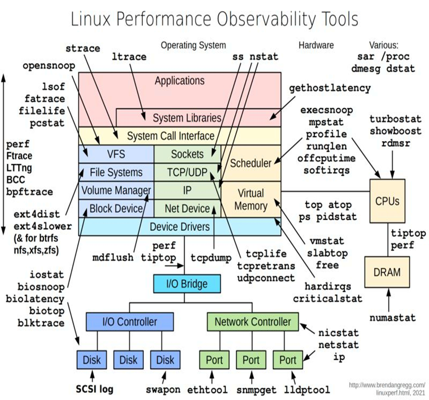

Since there are too many, we focus on most important tools.

‘**vmstat**’ - reports information about processes, memory, paging, block IO, traps, and CPU activity.

- ‘**iostat**’ - reports CPU and input/output statistics of the system.
- ‘**netstat**’ - displays statistical data related to IP, TCP, UDP, and ICMP protocols.
- ‘**lsof**’ - lists open files of the current system.
- ‘**pidstat**’ - monitors the utilization of system resources by all or specified processes, including CPU, memory, device IO, task switching, threads, etc.

## 11 Message queue
- Since the system must deal with desynchronization , such as messages brokers, the queue system is used to guarantee the safety of data as well as the order of which data are procssed
- Queues have three design principles
    - at-most-once: <span style="color:red">will lose data but have exceptional speed</span>
    - at-least-once: guaranteed to have duplicates of data, doomed if you use, doomed if you don't.
    - exactly-once: require another system of managing the queue, but the cost can be alleviated using hashes to guarantee at-least-once is used to confirm the transactions then overwrite the data with same hashes to store them

## 12 Where do we cache data
Not all data are needed to get cached, only data that are required to transfer.
Thus the tools that keep data cache should be either get access frequently or convieniently placed near users.

These include, but not limited to:
- Client apps (Duh) 
- CDN (Content Delivery Network)
- Load Balancer (Can be used if the system load is too heavy)
- Services (Cache strategies)
- Distributed Cache (**Use key-value pairs**, which make the database run smoother because operations can be sharded between machines)
- Database (Of course, a database of caches for databases)
Transaction log (Operating log, unconventional method)
Replication Log (Used frequently since it's a replica of the database at it's stable form)

## 13 Session, Cookie, JWT, OAuth2 and the birth of SSO

Long ago, when websites don't persist too many functions, a simple login form (today also known as WWW-A) was sufficient. 

Then everyone realized that every operation would need a login since **<span style="color:red">the authorization doesn't persist</span>**. Session and Cookie were created in response as a way for the server to retrieve the user data without relogging

But cookie **<span style="color:red">wasn't designed for mobile apps</span>**. So tokens were created as an universal way for all application to apply. JWT is created, **contains signing keys which can be trusted**.

Now we have too many applications, thus **<span style="color:red">signing in become a hassle</span>**. SSO solve this issue by sharing the user profile from a central authorization server.

OAuth serve as the policy which **All OPERATIONS MUST OBLIGE TO.**

<div style="page-break-after: always;"></div>

# Slide 14-24

## 14 Types of software engineers
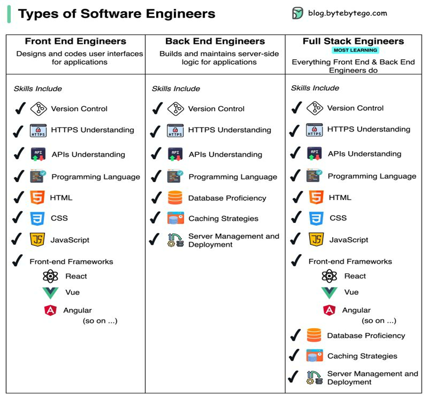

Front end is user sided, including **User Interfaces and User Experience**.

Back end is where **businesses logics are implemented and handled**.

Where the two sides meet are "Full Stack", the one where operations are performed at the most atomic form and delays are rarer, however, should the developers elope with another company, it spells **the end of the product without a manual**.

## 15 Webhook vs Polling
- Since operations don't always complete instantly, we needed a method for **desynchronization and data consistency.**
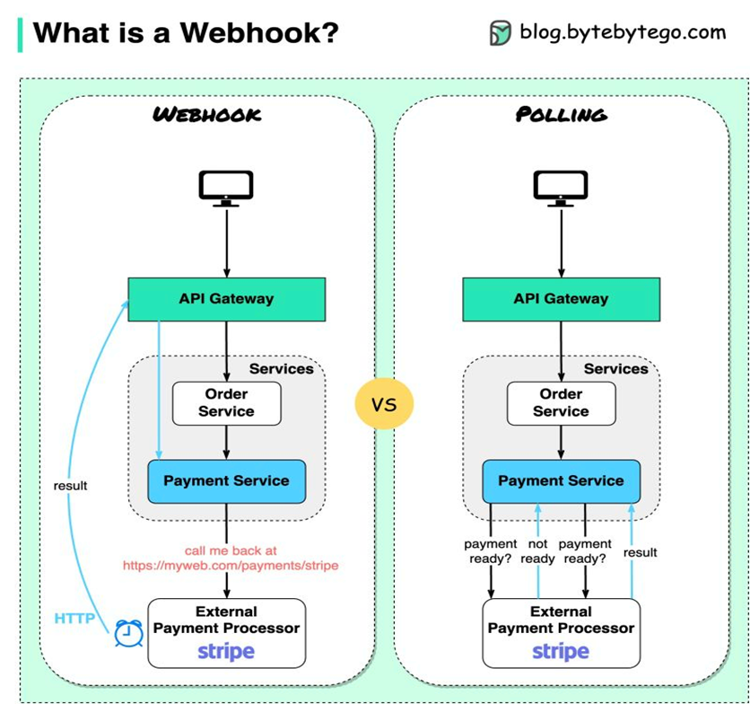
- Webhook serve as open port of the server, when the operations are run, **the client respond at this webhook address to notify the server of the completion, failure, delay, requirement.**
- Polling serve as a hotline between server and client and is the **fallback for the interact protocols** when Webhook is unavailable.

## 16 Inter-process communications
There are 5 types total, and we should only need these 5 unless something really bizarre happens.

- Pipe : Literally connecting one end of a process of another process. Similar to how apis work, it share the same weaknesses apis have 
- Message queue : Everything is recorded into a single queue
- Signal : Works similar to how machines ask for remote host ports, if a process is holding the connection, other processes will wait. <span style="color:red">May lead to race conditions</span>.
- Semaphore : Processes waits until the value is set to a certain value, in this way there is **no race condition or desyncrhonization**, but will look very weird.
- Virtual memory : Programs handle the communication by themselves, which is the most frequently used by large companies, but also the worst solution possible, prone to errors and should the virtual machine is hacked, there is no stopping it since the evil process already detached from the server.

## 17 Upload large files
- **Just cut the file, file cutter**, said the Multi-part upload.
- We reassemble the files back to their original state at the peers. This guarantee an integrity check is confirmed upon inspection.

## 18 Redis vs Memcached
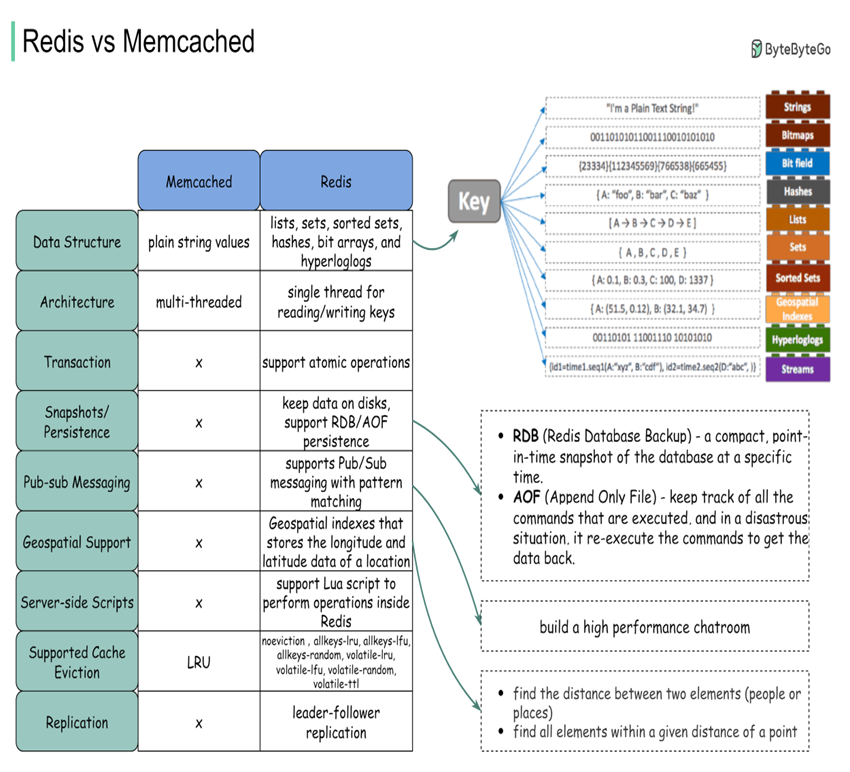
Redis is just superior to memcached, except for the architecture, because memcached relies on multiple processes which allows it for having multiple load balancers.

## 19 Eight data structure
They are known as the big 8 of data.

- Skiplist : Instead of an array, **each item know where the next and the previous item is**.
- Hash index : Used in map structure since anything with an unique index use map.
- SS Table : A data tree that **allows fast read and write access but need to re sort** every time new data are inserted into the database. Immutable.
- LSM Tree : Log structured merge tree, an abomination created by joining Skiplist and SS Table with are both known for their **high write throughput** since the pointer only contain a single unit of data.
- B Tree : Self balancing tree, the **most consistant performance** since it works well on disks.
- Inverted index : Instead of storing the data, we store a list of known data then store the new data in form of a tree made of known indexes from the list, **replacing the data with indexes**.
- Suffix tree : Hoffman tree. 
- R Tree : The more data overlaps, the better this database perform.

## 20 Where are data structures used
- list: Singular **array of information** that users can rely on
- stack: The evolution of any data are kept safe here
- queue: User actions in-game, since users know what they did and expect the game to **respect that order**
- heap: Task scheduling, anything with a tree structure is functional for a task schedule, or anything with order
- tree: Keep the HTML document structure, or for AI decision. Not viable as a tool of high performance data storage but **extremely efficient as the roadmap generators**. 
- suffix tree: Searching string in a document, a specific case of trees
- graph: **Tracking and visualize the data**
- r-tree: Finding the nearest neighbor, useful for clustering 
- vertex buffer: Sending data to GPU for rendering, very specific.

## 21 Design patterns

♦ Builder: Lego Master - Builds objects step by step, keeping creation and appearance separate. Similar to Factory but only produce evolutions of a class, completed in the last part. 

♦ Prototype: Clone Maker - Creates copies of fully prepared examples.

♦ Singleton: One and Only - A special class with just one instance. Useful for managing a single service.

♦ Adapter: Universal Plug - Connects things with different interfaces. Useful when the new interface is required for an old system, or when data types don't match.

♦ Bridge: Function Connector - Links how an object works to what it does. Connecting abstraction to implementer, this way interfaces can be reused for different similar classes and each class still hold their own implementations.

♦ Composite: Tree Builder - Forms tree-like structures of simple and complex parts. One components can contain sub components.

♦ Decorator: Customizer - Adds features to objects without changing their core. Like customizing a pizza, you can add cheese but the bread is always guaranteed. 

♦ Facade: One-Stop-Shop - Represents a whole system with a single, simplified interface. Batched commands are considered a part of facade system.

♦ Flyweight: Space Saver - Shares small, reusable items efficiently. Used in vm ware where processes share same hardwares, or users sharing the compiler in the same vm.

♦ Proxy: Stand-In Actor - Represents another object, controlling access or actions. Serve as an empty blanket that only call real data when needed.

♦ Chain of Responsibility: Request Relay - Passes a request through a chain of objects until handled. For example, an auto parsers will try every single compiler, each step is a part of the chain.

♦ Command: Task Wrapper - Turns a request into an object, ready for action. Basically an interface for interactions.

♦ Iterator: Collection Explorer - Accesses elements in a collection one by one. The most important part of any operation is accessing the data, and iterator provides the solution for all to use.

♦ Mediator: Communication Hub - Simplifies interactions between different classes. Like a coffee making machine, the users select options and the machine know which components to call, and in which order thanks to the meditator.

♦ Memento: Time Capsule - Captures and restores an object's state. A back up system for the class instances.

♦ Observer: News Broadcaster - Notifies classes about changes in other objects. Always listening to all changes to report to other components.

♦ Visitor: Skillful Guest - Adds new operations to a class without altering it. Visitor essentially add operations to classes without changing the classes, making it essential for hot fixes.

<div style="page-break-after: always;"></div>

## 22 Code Review Pyramid
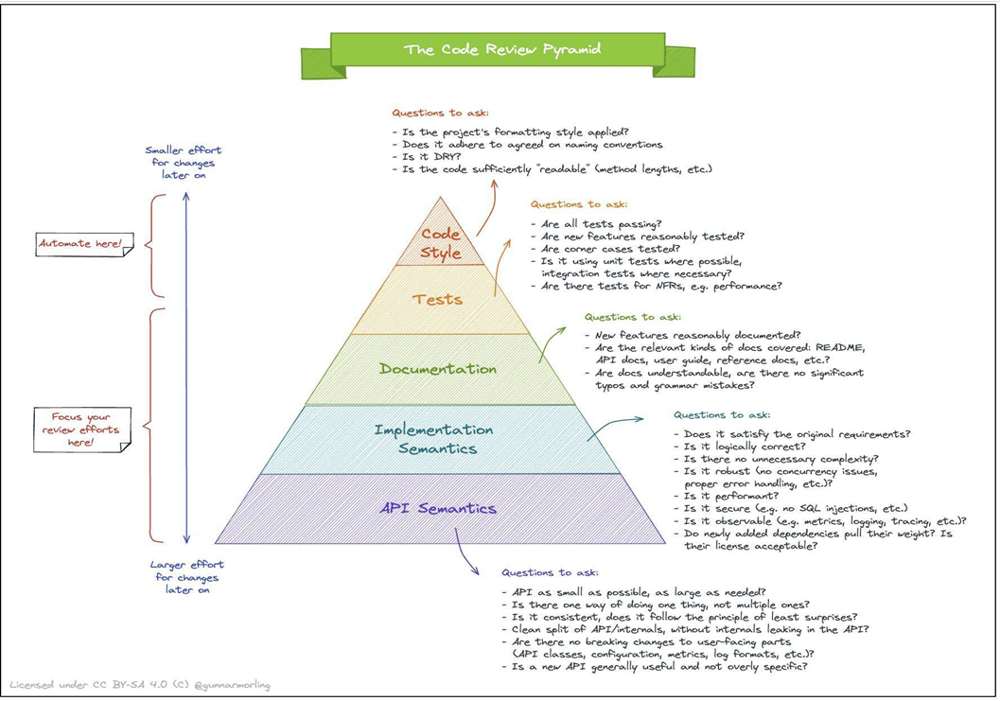
- If anything go wrong, ask the reviews.

<div style="page-break-after: always;"></div>

## 23 HTTP Responses
- Informational (100-199)
- Success (200-299)
- Redirection (300-399)
- Client Error (400-499)
- Server Error (500-599)
  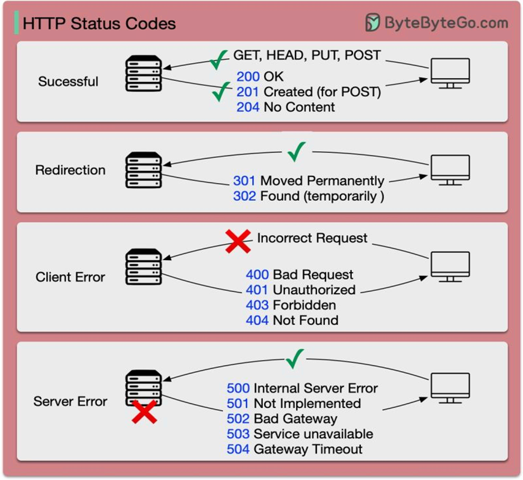

## 24 Writing codes that run on all platforms 
There are many options

- Cross platform intepreter : Constraint and extra works
- Using universal platform : Constraint on overhead since optimization is not possible
- Isolate platform support into code modules : Like adding more metal on a metal bar, it just get heavier and resistant to change
- Emulator : Compatibility is a guaranteed issue since the instruction sets may not be emulated efficiently.
- Adaptable code plans : Since universal codes are unreal, we create codes for the same functionalities accross languages and platforms.
- Engage in code sharing platform : How is this a solution ? It reduces the amount of works, but make the codes become complex since the codes are not designed to works with system requirements.

# Slide 25-35

## 25 Latency number we should know

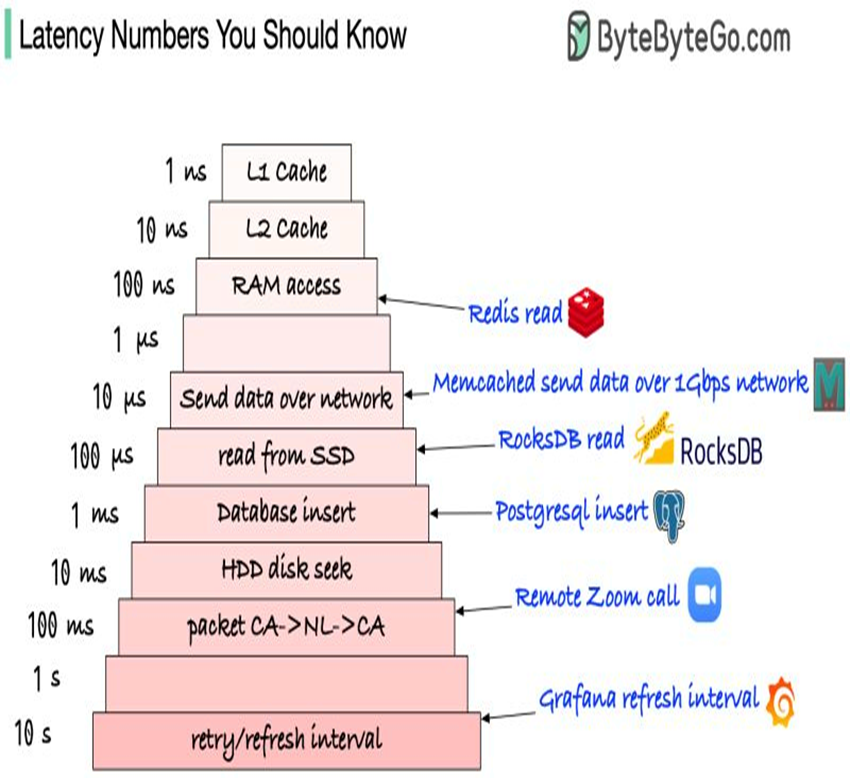

## 26 Proxy vs Reverse Proxy
Proxy protect users, reverse proxy protect the servers.

## 27 Symmetric vs Asymmetric Encryption
Both peers use the same system of keys which can always be used to access or encrypt the data, and since the data are encrypted in batches, **symmetric's fast.**

However, if bad actor grab a key, it's game over for security. When traffics happens, things are bound to be **lost in traffic**. And there can **only be so many keys** since the algorithms have a length standard.

Asymmetric keys don't need to transfer the secret key, which allows for **secured transfers between peers** as long as the secret key isn't lost.

The backside is that the algorithm is too complicated to run efficiently, which make encoding and decoding ultra **slower compared to the symmetric algorithms.**

## 28 Load balancing algorithm
Since a system can't always rely on a single unit to process all data.

### Static:
- Round Robin : A queue system which run based on whichever request came first, then whichever request surpass a certain degree of heavy duty will be partitioned into smaller parts. This also mean this balance only maintains **if the processing rate is assumed to be uniform across all instances of services, thus should only be available for stateless services.**
- Sticky R2 : Basically same as Round Robin but we assume each pair of query is from the same host, prone to errors.
- Weighted R2 : Now we specify a host is stronger than other host and allowed to handle more requests than others.
- Hash : Random BS goes here, why bother with balance when you can just send requests based on a rule that completely remove all optimizations.
### Dynamic:
- Least connections : Whichever peer has the least concurrent connections will be chosen for the next requests.
- Fastest response time : This is **the best solution but the most prone to error** due to the fact that a request might be too light to confirm how fast the system can respond.

## 29 What's the deal with Program and Process and even Thread ( get it ?)

- Programs are **sets of instructions.**
- Processes are the **loaded instances of a program in RAM**, hence there can be multiple processes of a same program.
- Threads are the **representations of the calculations being made by the program**, hence they have address of the virtual thread aka process.

With that established, no threads can run by themselves to produce meaningful actions, they need to notify other threads of their actions, which is why **inter-thread communication is required and must run fast since threads are inherently, I/O blocking operations.**

## 30 Cookie vs Session

Cookie was created as a solution for authorization, but that also means it **can get stolen.**

The solution was managing **a new entity that can effectively encapsulate the cookie, and server can control it directly** without interfering with legimate operations.

<div style="page-break-after: always;"></div>


## 31 What make URL an URL?
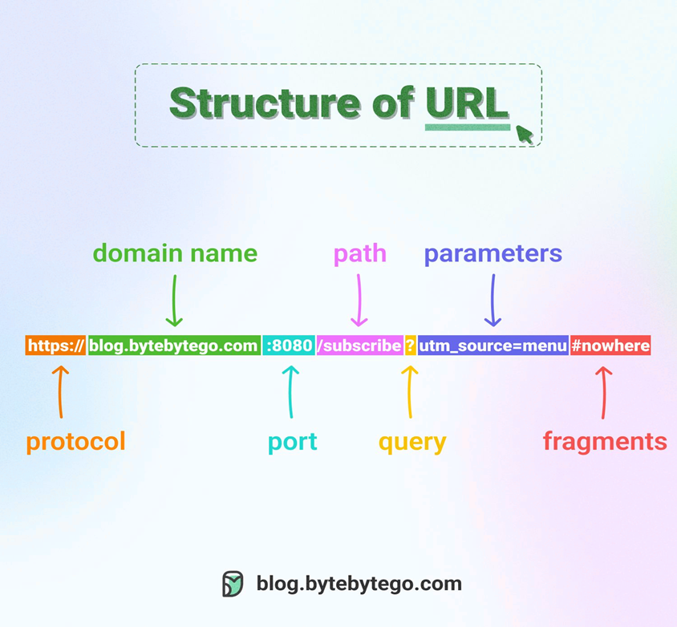
URL are , universal resource locator. URL innit?

But in all honesty, URL are important.

Query using URL are unsafe, but we can tolerate it for public API.

Parameters tell the host what the requests need. Fragments of all things are frequently used when dynamic loading wasn't a thing in older internet protocols. 

I'm not satisfied with this conclusion but URL are very ancient so we can't say more.

## 32 Internet Traffic Routing Policy

Just like a city, the internet has roads of traffic. Routing are just traffic laws that packets must follow in order to get to an end point. A server can have many mirrors to support a single service, each of these services are considered to be a single end point of the server.

There are total of 6 universal ways of doing it, but just like traffic laws, it only get to the point where congestions are impossible to avoid.

- Simple : Can't reach then just fail. Very common and the most frequently used by new devs since they don't have the fund to deal with back ups or fall back.
- Fall back : Fall back. It's just back up of the service. What more can you possibly squeeze from this other than the fact it's redundancy and expensive.
- Geolocation : Our houses have been next to each other since birth.
- Latency : Wrap me in plastic and let me shine. You basically never gonna meet me live.
- Multivalue answer : I have a coin, meet me on the flip side.
- Weighted routing policy : Democracy is eternal.

<div style="page-break-after: always;"></div>

## 33 JWT
All technical details are important 
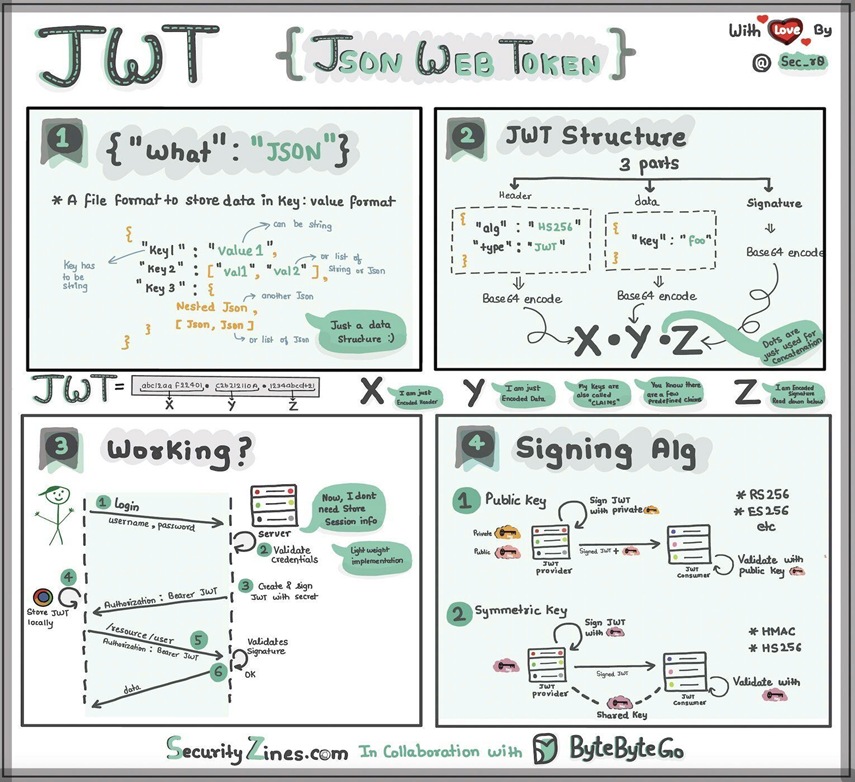

JWT is a token used for authentication.

<div style="page-break-after: always;"></div>

## 34 Linux Operating System Commands
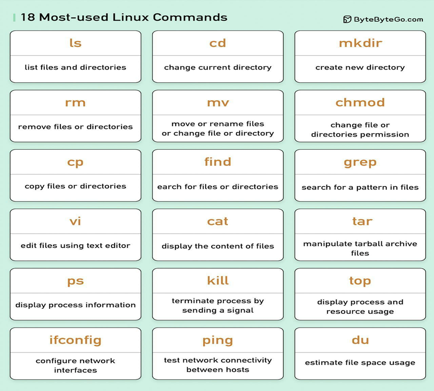

There is not a better description than this chart, if one need to use a more complicated command, command /help would guide the user.

<div style="page-break-after: always;"></div>

## 35 Linux Boot Process
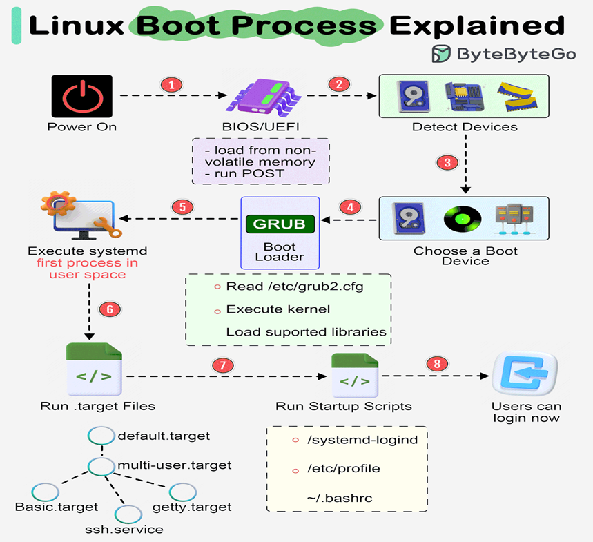

Power go into the circuit -> BIOS Awaken -> Request and detect devices -> Choose a boot device like disks -> Boot load using grub, execute kernel commands and load supported libraries -> execute systemd thus manage all processes and check all hardwares -> run target files which are default files -> execute startup scripts which are just shell commands and scripts that users customize.

<h1> This is the point </h1>
Well that's one-fifth of this 

<div style="page-break-after: always;"></div>

# Slide 36-46

## 36 Payment system
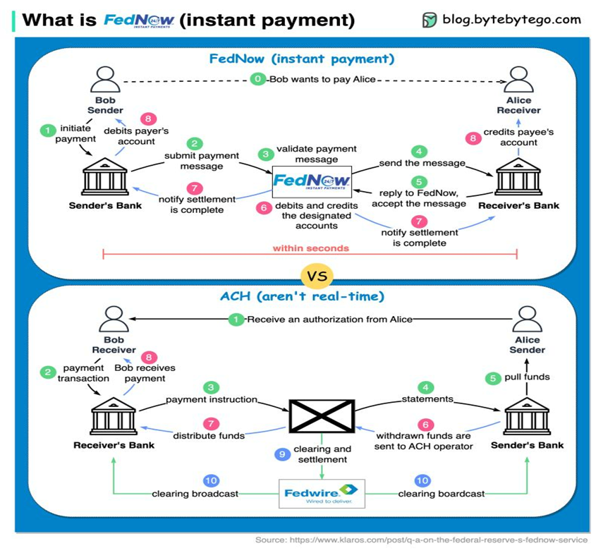

FedNow is automatic and FedWire which use ACH ( Automatic Clearing House aka only clearing the cached transactions ).

The difference is that ACH needs human operators since there are confirmation made by humans.

<div style="page-break-after: always;"></div>

## 37 OSI Models

Please Do Not Touch Sausage PizzA

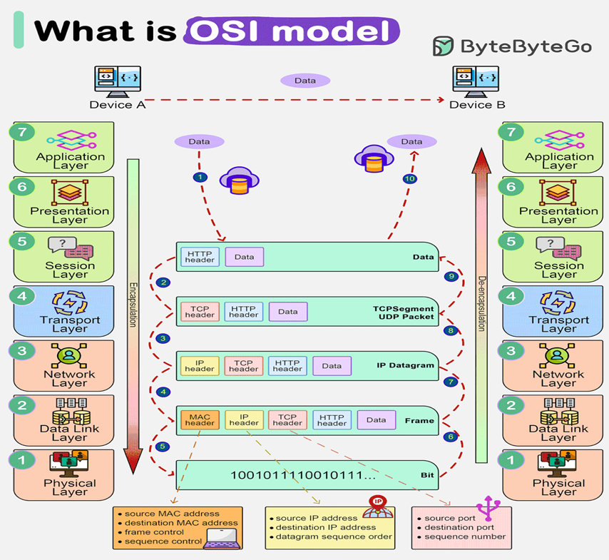

<div style="page-break-after: always;"></div>

## 38 Fullstack operations

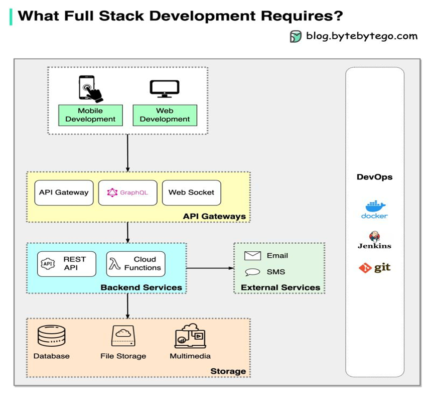

Everything a fullstack dev need is basically whatever you can imagine needed for a server operation.

<div style="page-break-after: always;"></div>

## 39 Web protocols

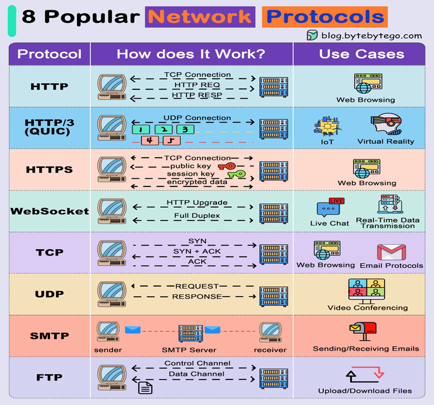

I don't think there is a remark to be made here, except i'm burned out.

## 40 ACID 

Our favorite rules, among ACIT

- Atomicity : Everything is chained together in batch, either the whole batch get accepted into the system or get rejected.
- Consistency : Github
- Isolation : Each query acts like the only running operation. We just throw the lost one out.
- Durability : Data is backed up

<div style="page-break-after: always;"></div>

## 41 OAuth 2.0

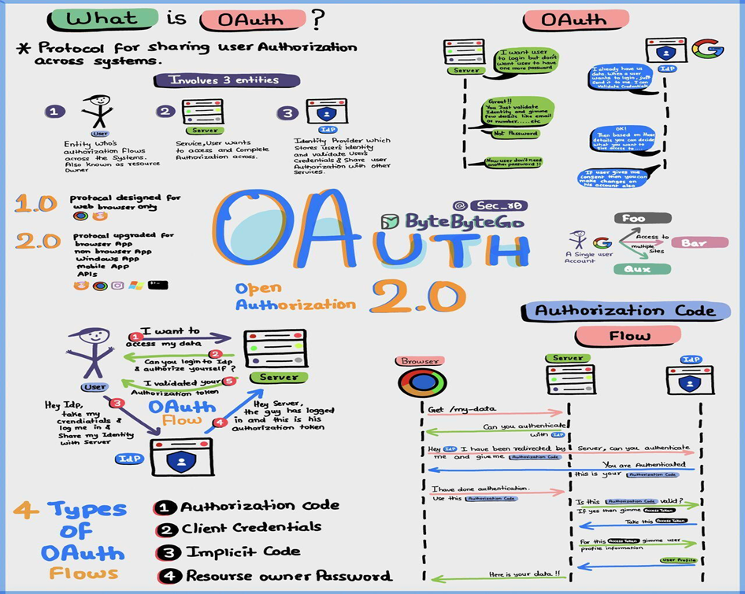

The land of promises, essentially just slap SSO on all services. Big companies hate this because they can't access user information.

<div style="page-break-after: always;"></div>

## 42: 9 http request types

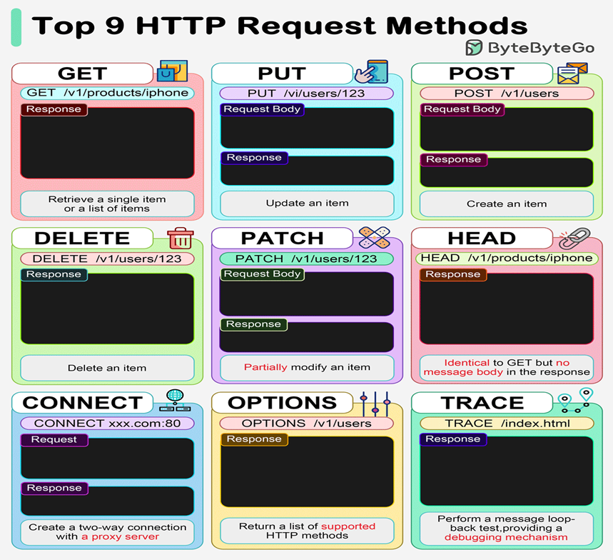

I remember all of them by heart.
We can summarize them with simple syntaxes.

<span style="font-size:29px">Get get, put change, post make, delete gone, patch partial, head rolling, connect tunnel, options list, trace loop.
</span>
That's all folks.

<div style="page-break-after: always;"></div>

## 43 SSO

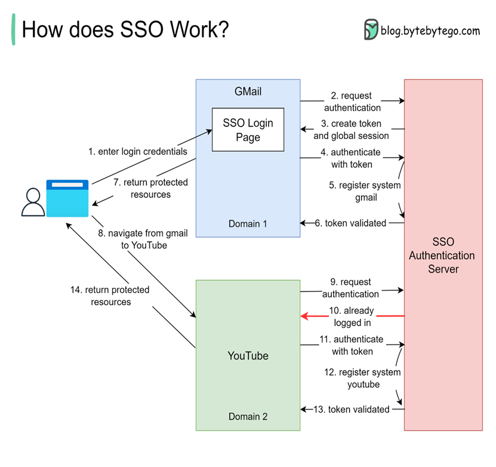

User make a single profile and share the same profile across all services and memes.

## 44 IaaS / PaaS / SaaS

Infrastructure is the hardware, Platform is the software foundation, Software is the implementation completed.

<div style="page-break-after: always;"></div>

## 45 Data Storage structure

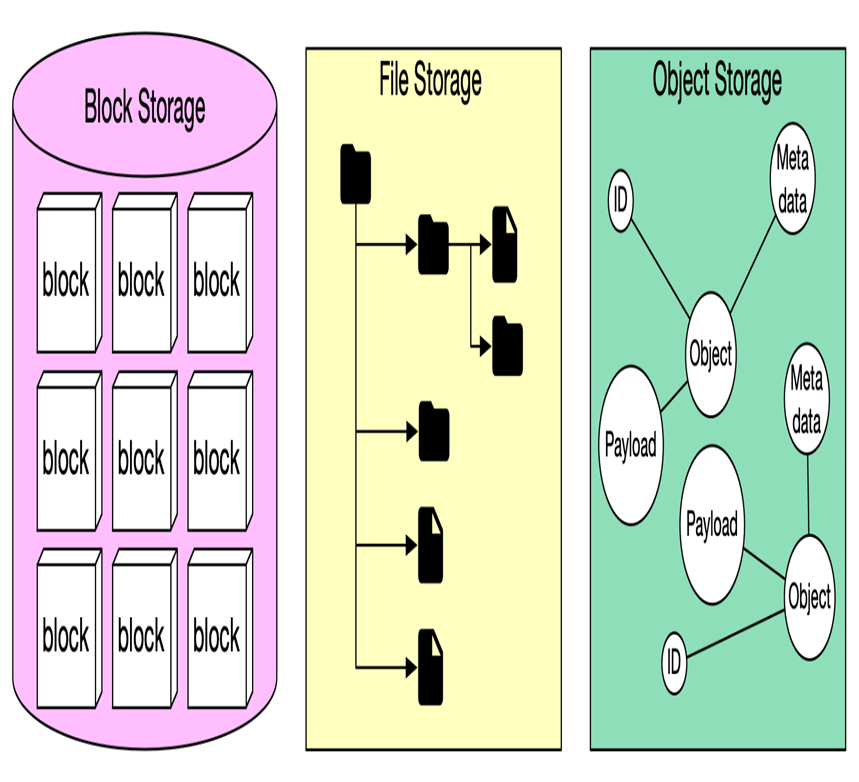

Block storage is just physical disk storage. File Storage are just a way of abstraction to manage the block storage.

Object storage are essentially raw bits data, thus cold. Therefore they don't need write access but frequently need to be retrieved from the service.

<div style="page-break-after: always;"></div>

## 46 Performance chart
For database

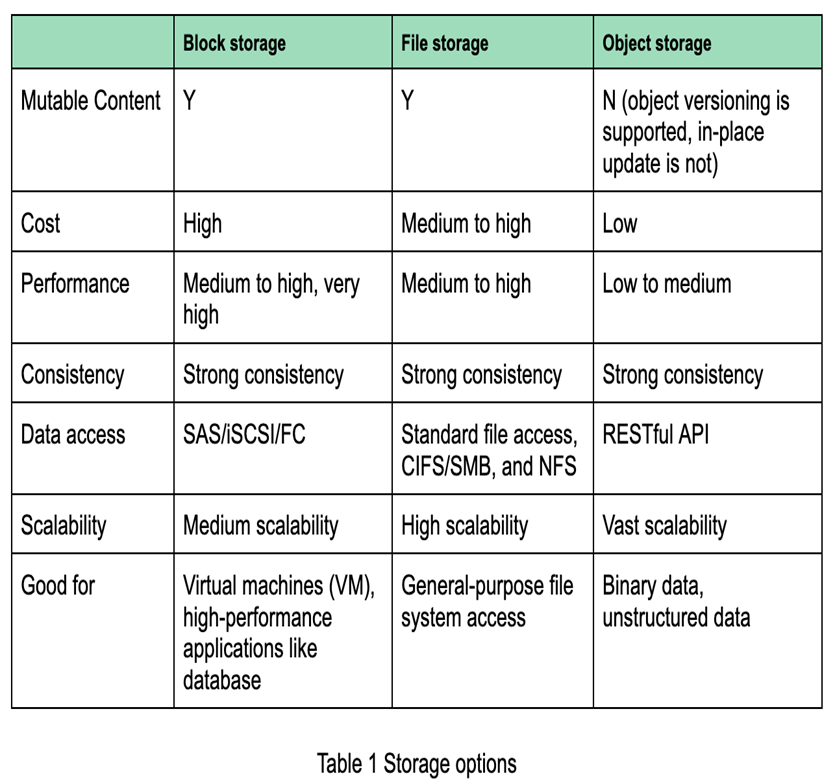

<div style="page-break-after: always;"></div>

# Slide 48-1-58

## 47 URL and URI and URN

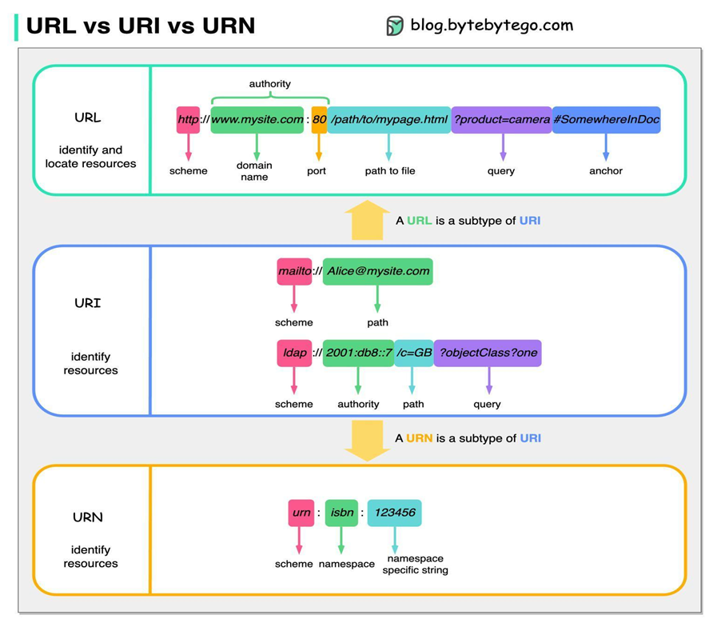

Locator knows, Identify only,

<div style="page-break-after: always;"></div>

## 48 OAuth2 flows

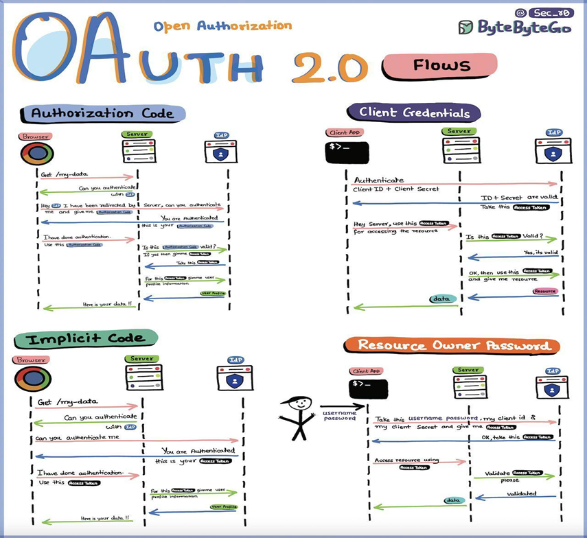

In Authorization Code flows, the user contact the IdP directly, but the server holds the actual access token and therefore is actually controlling the session.

All other flows, the user control the actual access token and the server only serve as a store clerk.

Think about buying stuffs in a shop.

User have a credit card. If we set AC route, user contact the clerk and have the clerk serve as a representative to the bank. 

If not, user are using checks, also known as debit cards. These checks are made before hand between users and their banking services which get validated or transacted from banks.

<div style="page-break-after: always;"></div>

## 49 HTTPs 
And the cluster of issues with it.

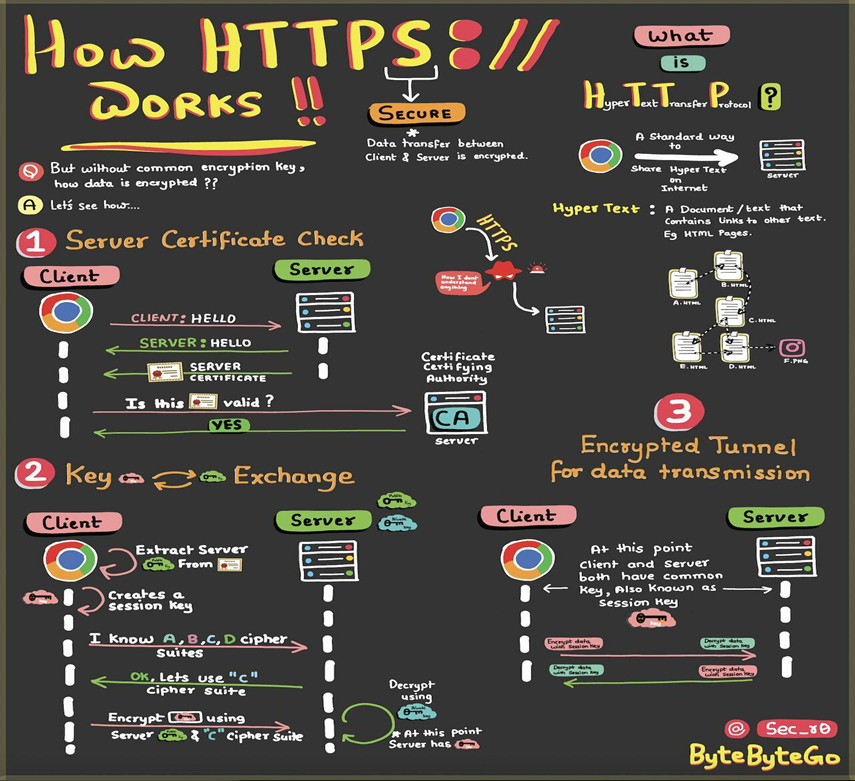

Https can be rectified and summarized with a single word. <span style="font-size:49px">**Asymmetric**</span>. 

All websites have their own cert, known as website certificates. In order to verify a website contents, there is a standard string that is verified by using said websites public key.

<div style="page-break-after: always;"></div>

## 50-51 CI/CD


If a program is a living creature, CI/CD is the age of it.

A program must follows the following cycle of development in order to get deployed.

From local repo : Staged changes are made and committed. Git serve as the historical archiver to save all changes made in the life time of the repo.

Git : After all changes are synced to the remote repo, collaborators can now see the changes and fetch it

Remote : With the changes received, the testing phase begin anew, with automated testing and manual testing to make sure features function as intended, servers can handle workloads, client requirements can be met without sacrificing new potential for developments.

In short, a very standard system. Where did it go all wrong in the actual deployment process?

## The actual massive problems with single CI/CD

<h1 style="font-size:89px">Is this big enough of a problem?</h1>

### Parallel feature development

New feature -> new build ->  new compilation -> new code breaks -> developer cries -> **can't fix the issue** without the original coder

New features rely on old components using **outdated library with more security holes** than swiss cheese

### Basic standard 

**No standard, no convention, more wasting time** in the editor chief department.

No one is **testing the code before integrations** so bugs are everywhere.

**No branching** since it's "harder to manage multiple pieces of code at once"


## The solution

Instead of indepedent CI/CD, we needed a more standard system of integrating the new codes without breaking everything we built.

Introducing CI/CD pipelines. Notice how it is different from normal CI/CD.


It's never ending cycles of works, with a twist.

## The actual implementation

Git Pull Request. 

Instead of mashing all builds together, all developers share a **common build tree**, then **branch** from that tree and begin to make their own codes modifications for their functionality specifically.

Note that this **does not cover core library changes.**

This is only half the battle, and the core reason of all the suffering one have to go through.

## 52 Kafka

Kafka is fast, unlike it's difficulty to remember it's name.

The reason is simple: Ordered I/O. Also known by it's better name. **Sequential I/O**.

The cache can **consume time, even with this writing speed**.

Remove cache speed problem by **no cache, aka zero-copying** techniques.

Since the program is using a connection, usually data changes are stated in the socket buffer for speed upload then written to NIC (Network Interface Card) for transfering. 

Kafka removes the need for writing in socket buffer since the server operate on **single-flow principle: in and out** are in **different ports gates**.

<div style="page-break-after: always;"></div>

## 53 Git

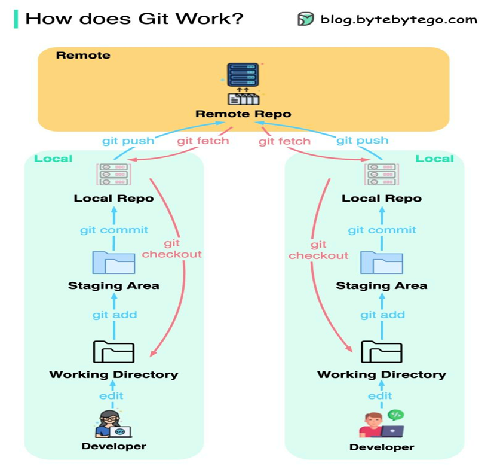

Or it's more monstrous official title given by companies.

Distributed version control system.

Everything is only edited on their own branches. Everything is update with CDC and hashed version number. Thanks to this partial editing, and the final changes are only finalized in the push, git allows **desynchronized devsecops**.

<div style="page-break-after: always;"></div>

## 54 Cloud Native Anti Patterns

Whose idea was it to just move everything to the internet?

Let's dive in the most vile piece of skill issue the world ever see in IT.

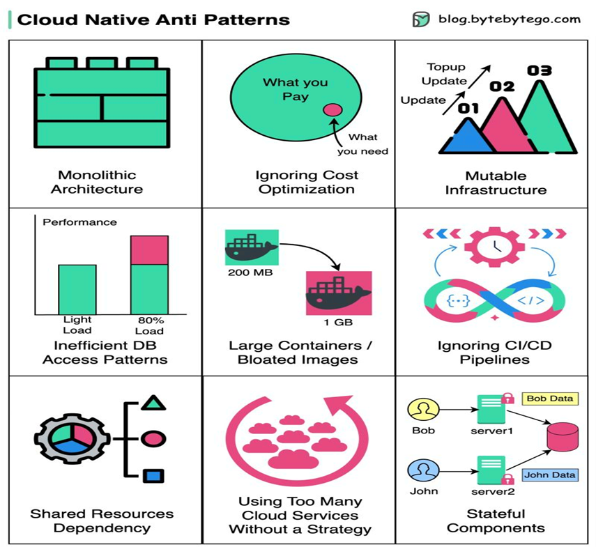

- Monolithic Architecture: We can't see any other way of operating this sustem. -> We won't support it.
- Ignoring Cost Optimization: Since everything now runs on the cloud, you will have to put up with whatever problems come with using a remote host.
- Mutable Infrastructure: You don't ever corporate components together. If you do, you will be doomed to update.
- Inefficient DB Access Patterns: Overly complicated DB queries(looking at security) and lacks of indexing(FFA styles) leads to bottlenecks. What? You are telling me that database was failing due to bad database designs?
- Large containers / Bloated image: If you keep putting parts of a program into a singleton unit, you will suffer.
- Ignoring CI/CD Pipelines: Manually dying inside.
- Shared Resources Dependency: Since most of the processes are now sharing a same system of access on cloud, everything will go wrong at a slightest sight of a conflict between processes.
- Using too many cloud services without a strategy: Too many airports without airplanes or customers.
- Stateful Components: Lifting components up to manage them leading to overheads for states management.

## 55 Monorepo vs Microrepo

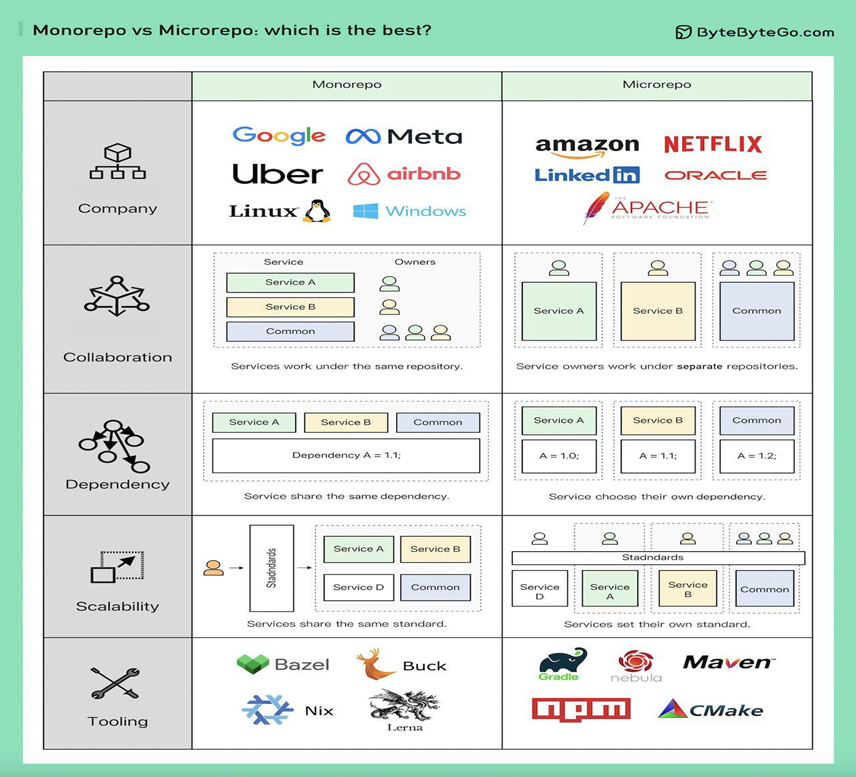

Companies have different strategies of developing softwares. 

<div style="page-break-after: always;"></div>

## 56 Microservice stack - Technology stack 

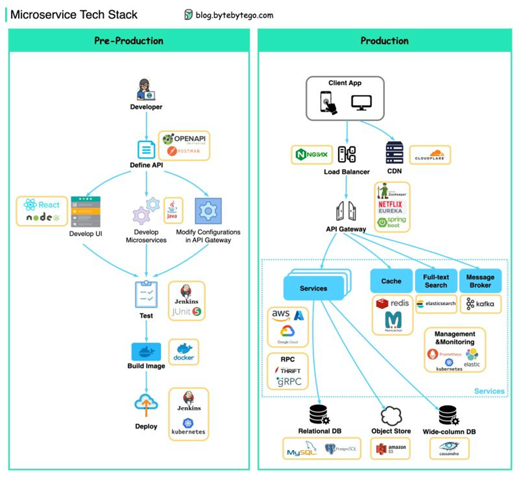

<table style="width:100%; border: 1px solid black; border-collapse: collapse;">
  <tr>
    <th style="width:50%; border: 1px solid black;">Pre-production</th>
    <th style="width:50%; border: 1px solid black;">Production</th>
  </tr>
  <tr>
    <td style="border: 1px solid black;">Define API</td>
    <td style="border: 1px solid black;">NGinx</td>
  </tr>
  <tr>
    <td style="border: 1px solid black;">Development</td>
    <td style="border: 1px solid black;">API Gateway</td>
  </tr>
  <tr>
    <td style="border: 1px solid black;">Continuous</td>
    <td style="border: 1px solid black;">The microservices are deployed on clouds</td>
  </tr>
  <tr>
    <td style="border: 1px solid black;"></td>
    <td style="border: 1px solid black;">Cache and Full-text Search</td>
  </tr>
  <tr>
    <td style="border: 1px solid black;"></td>
    <td style="border: 1px solid black;">Communications</td>
  </tr>
  <tr>
    <td style="border: 1px solid black;"></td>
    <td style="border: 1px solid black;">Persistence</td>
  </tr>
  <tr>
    <td style="border: 1px solid black;"></td>
    <td style="border: 1px solid black;">Management & Monitoring</td>
  </tr>
</table>


<div style="page-break-after: always;"></div>

## 57 Kurbenetes Tools Ecosystem

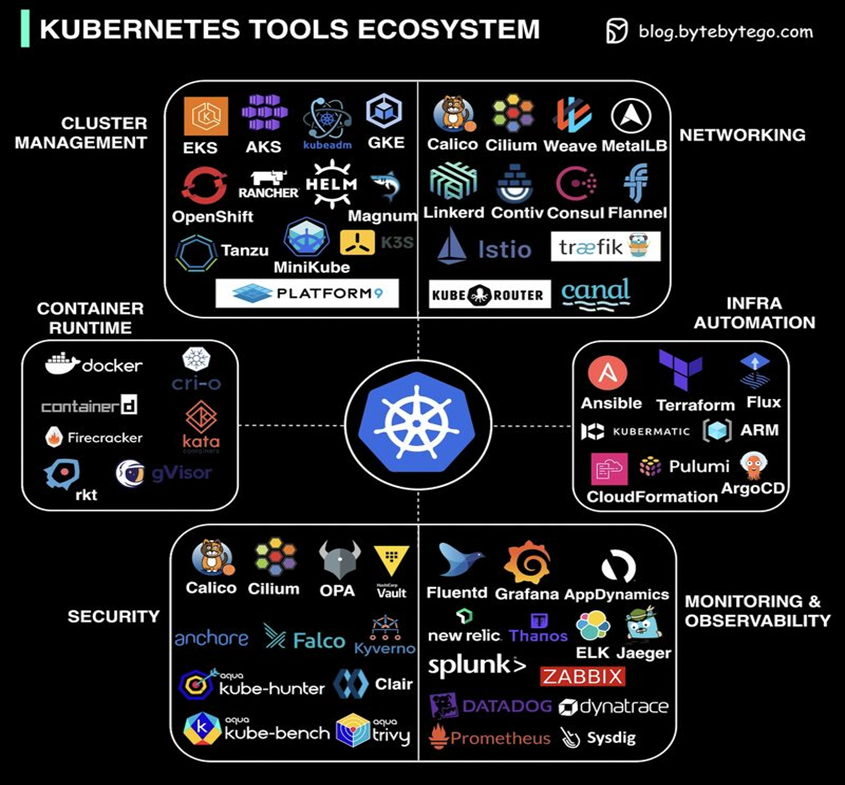

There are many tools but we just need to know 6 categories:
- Cluster Management
- Networking
- Container Runtime
- Infra Automation
- Security
- Monitoring and Observability
  
<div style="page-break-after: always;"></div>

## 58 What is k8s

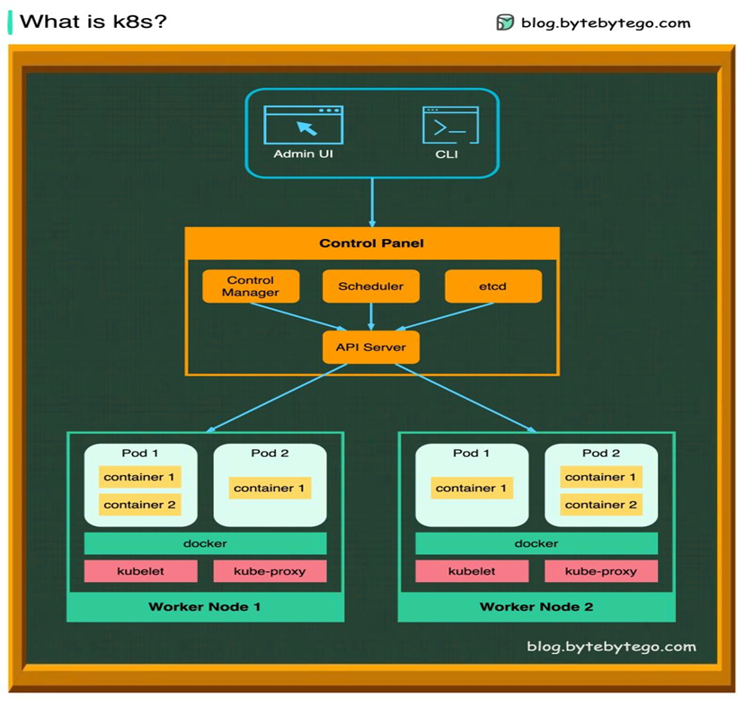

### Control Plane Components
1. API Server: Front end for administrators and users to interact with the cluster.
2. Scheduler: Assign Pods to Node. Pods are softwares, Node are Platforms.
3. Controller Manager: Use API server to make sure the system is running pods in healthy state.
4. etcd (Distributed Key-Value Store) keeping all information of the cluster.
### Nodes
1. Pods: A set or subset of containers that share resources within the pod: storage, network, lifecycle
2. Kubelet: Manage and make sure containers inside a pod run, independent on each pod.
3. Kube Proxy: Protection between inside and outside, among the pods.

<div style="page-break-after: always;"></div>

# Slide 59-69
## 59 Cloud History

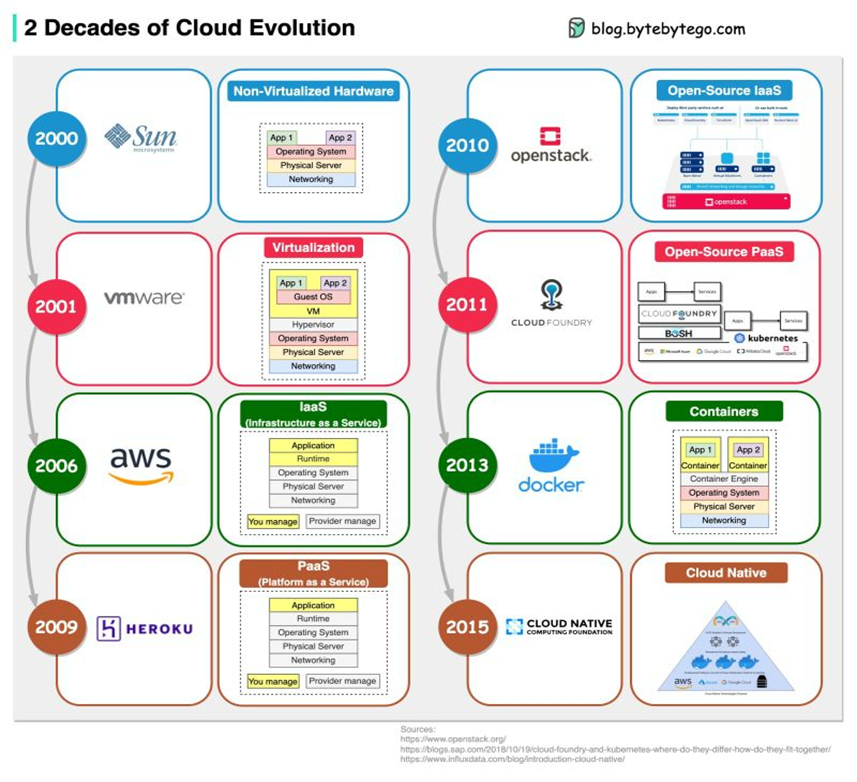

It's just history and doesn't support the actual image of the current landscape of the technology.

<div style="page-break-after: always;"></div>

## 60 Convert Cloud Native

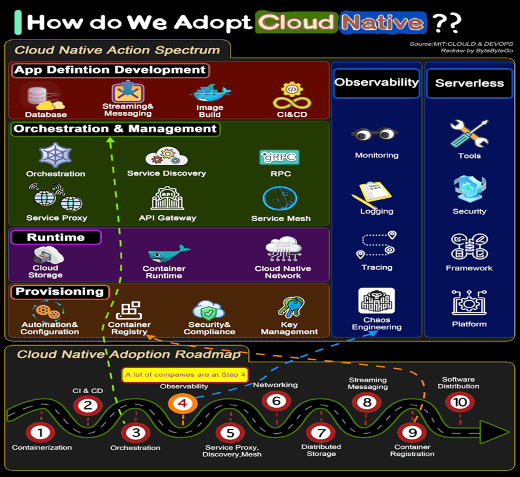

### 1. Application definition development
- Database: If a software doesn't rely on database, it should be serverless. Otherwise, it's a desynchronization disaster waiting to happen.
- Containerization/ Image build: Turn softwares into a proper pod.
- CI/CD: Put it through the pipeline.
### 2. Orchestration and management 
- Orchestration: Automation of everything in a single piece of endpoint.

- Service Proxy, Discovery Mesh: Intermediator for requests. Instead of letting programs manually configure each dependency, all dependencies are managed by an abstraction layer, known as discovery mesh, allowing easier requests handling.

### 3. Runtime
- Cloud storage: Since everything works on cloud, of course you would need an actual database system that on cloud also always run to ensure connectivity and definitions update.
- Container runtime: Anything that make sure the container is operational, as presented in docker slide - 61

### 4. Provisioning
It's about managing and setting up the necessary infrastructure and resources required to run the application.
- Automation and configuration: Literally it but for containers. In this case we are talking about Kurbenetes as a tool.
- Container registry: Basically a dictionary for containers.
- Security and Compliance: If the manager can't control the unit then there is no point in deploying it in the first place.
- Key management
### 5. Observability: Understanding the systems and services in operations, allows generation of system data: including operation flows, system image for deployment, health status.
### 6 Serverless
- If something run without a need for interaction but open for inspection, it's called a serverless component.
- These includes hardware(duh), tools(how wild is this), framework(what), and platform.

<div style="page-break-after: always;"></div>

## 61 Docker


Summarized with a sentence: Everything all in one at the same location with minimal external dependency and no hardware restrictions.

Explained in details on how to install and use in C_06_Docker+K8S, due to the length of this file.

<div style="page-break-after: always;"></div>

## 62 Cloud Network Components Cheatsheet

May or may not be oudated. Need more investigations.

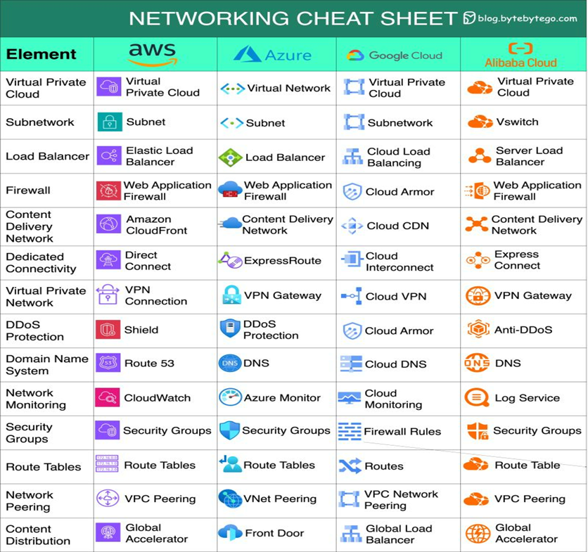

<div style="page-break-after: always;"></div>

## 63 Git merge vs git rebase vs squash commit

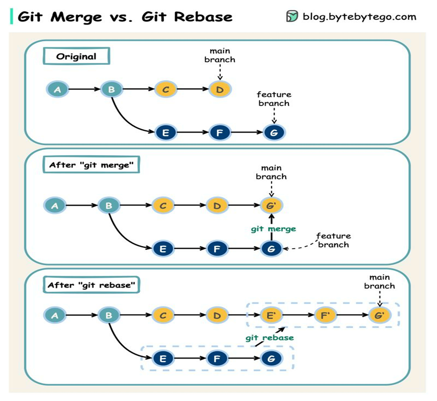

Git merge add modifications to the main branches without destroying changes made in either branch.

Git rebase add modifications behind the lastest commit, turning it into a linear update tree.

<div style="page-break-after: always;"></div>

## 64 Docker vs Kurbenetes

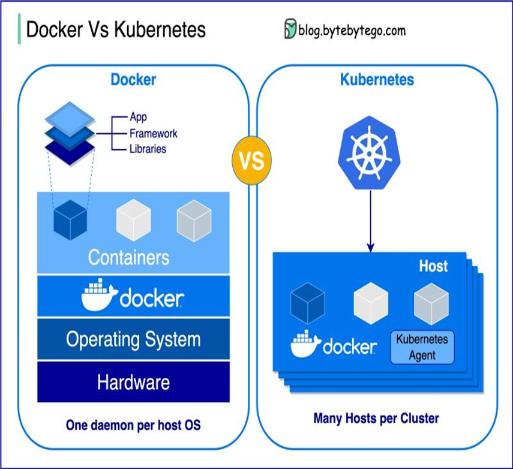

Explained in details in K8S.

## 65 How does Docker work

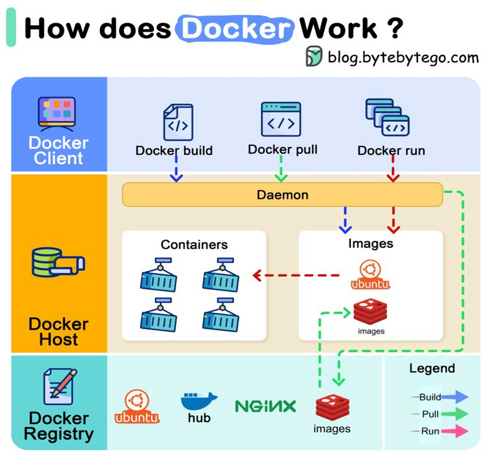

